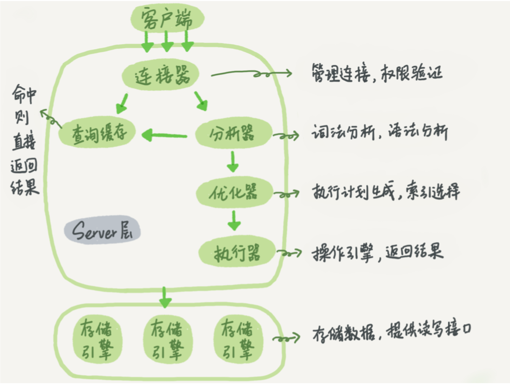

# mysql基础架构

学习mysql开始先来看看，底下这张架构图描述mysql的基本架构

mysql大致分为server层和存储引擎层

1. server层
    1. 连接器
        建立客户端与mysql的连接分为长链接与短链接。长链接导致内存占用过快，短链接频繁创建开销比较大
        1. 定期断开长连接。使用一段时间，或者程序里面判断执行过一个占用内存的大查询后， 断开连接，之后要查询再重连。
        2. 如果你用的是 MySQL 5.7 或更新版本，可以在每次执行一个比较大的操作后，通过执 行 mysql_reset_connection 来重新初始化连接资源。这个过程不需要重连和重新做权 限验证，但是会将连接恢复到刚刚创建完时的状态。
    2. 查询缓存
        在执行一条查询命令，会在缓存中查看是否执行过，但表的更新会清除缓存，已经不建议使用
    3. 分析器
        对sql语句执行词法分析生成token检查语句是否正确
    3. 优化器
        对多个索引查询和联表查询进行优化
    4. 执行器
        执行sql语句
2. 存储引擎
  真正来存储和读取数据的引擎，有多种存贮引擎可以自行选择