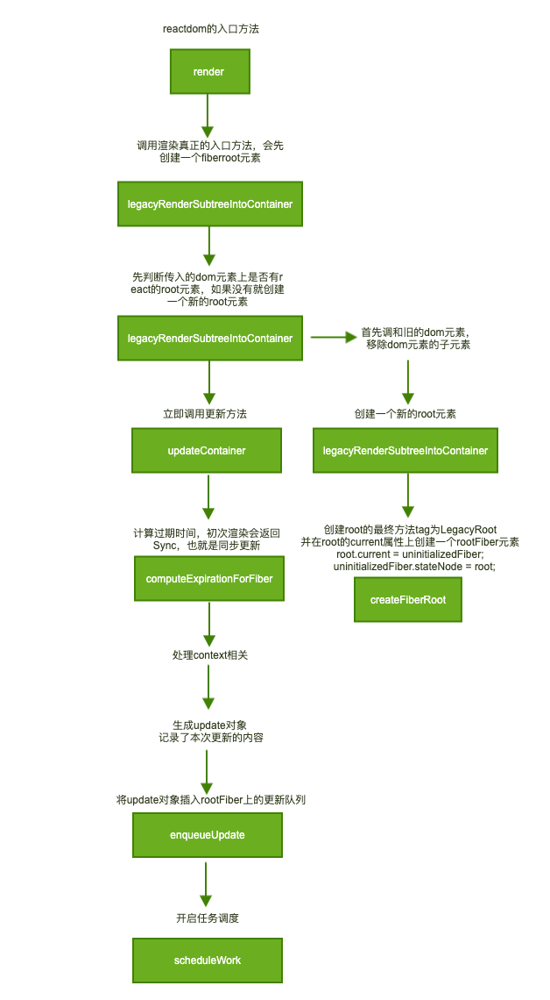

# render过程

我们想了解react的工作机制，我们直接去看源码很难去弄懂每一步到底是做什么的，在复杂的函数调用中我们很容易让自己迷失，所以我决定跟随一些常用方法来分析工作机制，第一篇就是`ReactDOM.render`这个入口方法,在讲解中我会直接忽略dev和调试的代码，因为这与工作机制无关。
先来看下主要的流程


先来看一下入口代码

```js
/**
 * 渲染dom的入口方法
 * @param {*} element
 * @param {*} container
 * @param {*} callback
 */
export function render(
  element: React$Element<any>,
  container: DOMContainer,
  callback: ?Function,
) {
  invariant(
    isValidContainer(container),
    'Target container is not a DOM element.',
  );
  return legacyRenderSubtreeIntoContainer(
    null,
    element,
    container,
    false,
    callback,
  );
}

/**
 * render方法真正调用的主方法
 * 主要步骤有初次渲染，创建fiberroot对象->将更新
 */
function legacyRenderSubtreeIntoContainer(
  parentComponent: ?React$Component<any, any>,
  children: ReactNodeList,
  container: DOMContainer,
  forceHydrate: boolean,
  callback: ?Function,
) {
  let root: RootType = (container._reactRootContainer: any);
  let fiberRoot;
  // 首次渲染时不存在这个元素，初次渲染进入这个逻辑
  if (!root) {
    root = container._reactRootContainer = legacyCreateRootFromDOMContainer(
      container,
      forceHydrate,
    );
    fiberRoot = root._internalRoot;
    if (typeof callback === 'function') {
      const originalCallback = callback;
      callback = function() {
        const instance = getPublicRootInstance(fiberRoot);
        originalCallback.call(instance);
      };
    }
    // 初次渲染不需要批处理要立即同步更新
    unbatchedUpdates(() => {
      updateContainer(children, fiberRoot, parentComponent, callback);
    });
  } else {
    fiberRoot = root._internalRoot;
    if (typeof callback === 'function') {
      const originalCallback = callback;
      callback = function() {
        const instance = getPublicRootInstance(fiberRoot);
        originalCallback.call(instance);
      };
    }
    // 不是首次渲染，比如之后调用setState更新都会将更新加入队列，等待事务调度更新
    updateContainer(children, fiberRoot, parentComponent, callback);
  }
  return getPublicRootInstance(fiberRoot);
}
```

这里我们实际调用的是legacyRenderSubtreeIntoContainer，将我们传入的组件也就是element挂载到传入的dom元素上。
首先我们会获取dom上的一个root元素，如果没有证明我们是初次渲染，如果不是调用更新的方法。
官网上有一段例子，我觉得能很好理解这个过程当我们第一次执行tick会走初次渲染的逻辑，后边的我们会走更新的逻辑，这也是为什么我们不用setState也能达到更新页面的效果

```js
function tick() {
  const element = (
    <div>
      <h1>Hello, world!</h1>
      <h2>It is {new Date().toLocaleTimeString()}.</h2>
    </div>
  );
  // 重复调用
  ReactDOM.render(element, document.getElementById('root'));
}
setInterval(tick, 1000);
```

在react中我们将这个root叫fiberRoot元素，这是整个渲染树唯一的根节点，上边相应的也会挂载很多属性。这里我们先不去看这个数据结构。只看大体流程这里我们将的是render所以只说初次渲染的逻辑
我们实际会在`unbatchedUpdates`中调用`updateContainer`
这个`unbatchedUpdates`实际上是一种强制同步更新的方法我们先看源码。这里我们其实就是处理了传入函数的`executionContext`上下文
`executionContext &= ~BatchedContext;executionContext |= LegacyUnbatchedContext;`这里的意思就是我们要将`LegacyUnbatchedContext`这种类型合并进当前上下文，在方法执行完后再恢复之前的执行环境。
当在这种上下文的环境下react的更新会走同步的逻辑，因为这是第一次更新，用户要尽快的看到页面的内容，所以不需要走异步更新的逻辑

```js
/**
 * 同步更新任务
 */
export function unbatchedUpdates<A, R>(fn: (a: A) => R, a: A): R {
  const prevExecutionContext = executionContext;
  executionContext &= ~BatchedContext;
  executionContext |= LegacyUnbatchedContext;
  try {
    return fn(a);
  } finally {
    executionContext = prevExecutionContext;
    if (executionContext === NoContext) {
      // Flush the immediate callbacks that were scheduled during this batch
      flushSyncCallbackQueue();
    }
  }
}
```

接下来我们就要看看这个`updateContainer`了，这里我们进入了更新的主逻辑。方便理解还是先贴出主要代码。

```js
/**
 * 更新的主逻辑，
 * 计算过期时间->创建更新的update对象->加入到调度队列->并开启任务调度
 */
export function updateContainer(
  element: ReactNodeList,
  container: OpaqueRoot,
  parentComponent: ?React$Component<any, any>,
  callback: ?Function,
): ExpirationTime {
  // 获取root上的根fiber对象
  const current = container.current;
  // 获取当前的时间节点
  const currentTime = requestCurrentTimeForUpdate();
  // 计算当前的到期时间
  const expirationTime = computeExpirationForFiber(
    currentTime,
    current,
    suspenseConfig,
  );
  // 处理context相关
  const context = getContextForSubtree(parentComponent);
  if (container.context === null) {
    container.context = context;
  } else {
    container.pendingContext = context;
  }
  // 生成update对象，是批处理更新的一个单元
  const update = createUpdate(expirationTime, suspenseConfig);
  // 为update对象具体要更新的参数赋值，传入的是ReactElement元素
  update.payload = {element};
  // 将update将入fiber根对象上的任务队列
  enqueueUpdate(current, update);
  // 开始执行任务调度，在到期时间内
  scheduleWork(current, expirationTime);

  return expirationTime;
}
```

主要流程就是如下步骤 计算过期时间->创建更新的update对象->加入到调度队列->并开启任务调度
什么是过期时间，说到这里要先说下react16之后的新概念fiber，能支持我们在执行耗时任务的时候可以跳出来相应一些高优先级的事件，比如我们在一个循环中执行一些复杂计算。但这时候用户通过input打字，我们就要即时响应输入操作，这在原来是做不到的。我们来实现这个功能主要靠的就是expirationTime过期时间这个概念。保证任务要在这个时间段内完成，如果超时了那么就要立即在下一个事件循环中完成
然后就是生成一个update对象用来记录更新的内容，将这个update对象插入rootFiber上的更新队列(基于链表实现)
最后开启任务调度，这里render的执行阶段就执行完了，接下来的任务就交给react的任务调度器去完成这也是下一篇要说的

## expirationTime

先来看看关于过期时间的计算

```js
// 值越大优先级越高
export function msToExpirationTime(ms: number): ExpirationTime {
  // Always add an offset so that we don't clash with the magic number for NoWork.
  return MAGIC_NUMBER_OFFSET - ((ms / UNIT_SIZE) | 0);
}
function ceiling(num: number, precision: number): number {
  return (((num / precision) | 0) + 1) * precision;
}

function computeExpirationBucket(
  currentTime,
  expirationInMs,
  bucketSizeMs,
): ExpirationTime {
  return (
    MAGIC_NUMBER_OFFSET -
    ceiling(
      MAGIC_NUMBER_OFFSET - currentTime + expirationInMs / UNIT_SIZE,
      bucketSizeMs / UNIT_SIZE,
    )
  );
}

export const HIGH_PRIORITY_EXPIRATION = __DEV__ ? 500 : 150;
export const HIGH_PRIORITY_BATCH_SIZE = 100;
// 计算高优先级的时间
export function computeInteractiveExpiration(currentTime: ExpirationTime) {
  return computeExpirationBucket(
    currentTime,
    HIGH_PRIORITY_EXPIRATION,
    HIGH_PRIORITY_BATCH_SIZE,
  );
}

export const LOW_PRIORITY_EXPIRATION = 5000;
export const LOW_PRIORITY_BATCH_SIZE = 250;
// 计算低优先级的时间也就是过期时间
export function computeAsyncExpiration(
  currentTime: ExpirationTime,
): ExpirationTime {
  return computeExpirationBucket(
    currentTime,
    LOW_PRIORITY_EXPIRATION,
    LOW_PRIORITY_BATCH_SIZE,
  );
}
```

这里主要用的就是`computeAsyncExpiration`和`computeInteractiveExpiration`这个两个不同优先级时间的计算，关于`ceiling`的计算我这里有一个例子

```js
ceiling(10011, 10)//10020
ceiling(10019, 10)//10020
```

可以看到在计算值的时候会在每10个时间间隔内的过期时间都相同，相对的Async的间隔为25，而Interactive的时间间隔为10。这也保证了在这个时间间隔内的时间都会有相同的过期时间，这保证了在这段时间内触发的任务的优先级相同。保证一同触发的任务同时完成

再来看看当前时间的获取

```js
/**
 * 计算当前时间
 */
export function requestCurrentTimeForUpdate() {
  if ((executionContext & (RenderContext | CommitContext)) !== NoContext) {
    // We're inside React, so it's fine to read the actual time.
    // 执行的上下文是render或者commit，在执行阶段获取真实时间
    return msToExpirationTime(now());
  }
  // We're not inside React, so we may be in the middle of a browser event.
  // 如果我们没在react内部更新中，可能是在执行浏览器的任务中
  if (currentEventTime !== NoWork) {
    // Use the same start time for all updates until we enter React again.
    return currentEventTime;
  }
  // This is the first update since React yielded. Compute a new start time.
  // 之前的任务已经执行完，开启新的任务时候需要重新计算时间
  currentEventTime = msToExpirationTime(now());
  return currentEventTime;
}


```

首先在render和commit阶段我们直接获取当前真实时间。
然后如果当前有任务在执行我们返回之前计算的当前时间，这也就确保了几毫秒之内触发任务我们会以相同的当前时间计算。
最后如果没有任务我们计算一个新的当前时间并赋给全局变量。
然后就是过期时间的计算了在初次渲染时会直接返回同步更新的标识
