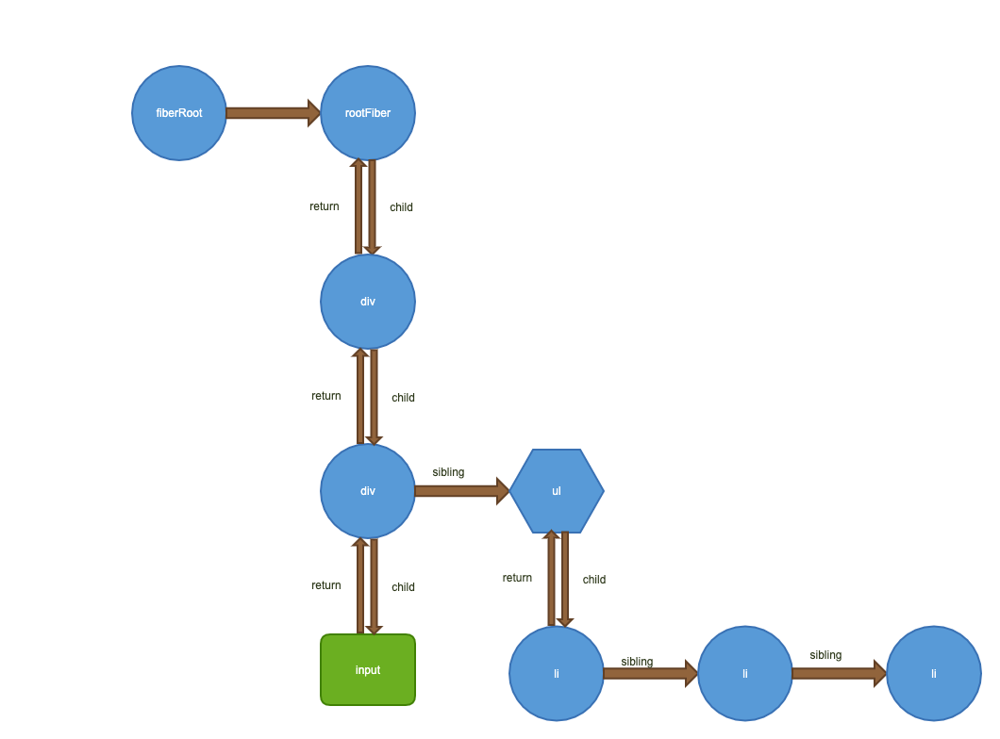
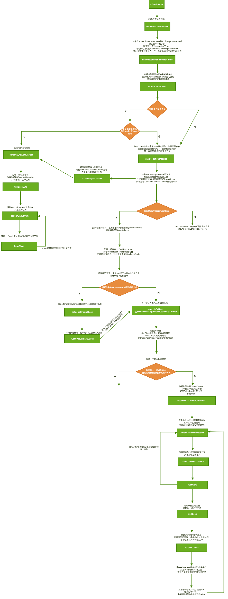

# 任务调度

在上一篇中说过了render的过程，最后会调用`scheduleWork`来执行任务。react将不同的任务分为了不同的优先级，有些任务可以异步执行，有的必须要同步执行。这样区分开来也是确保了对于用户的行为需要立即响应，所以也有了插队的机制。我们一起来看下这个过程，在源码中最后实际调用的就是`scheduleUpdateOnFiber`这个方法。从名字上就可以看出这里的更新主要是对fiber进行的更新，这也是为什么hooks是函数但也可以保持state的原因，因为状态是在fiber上的。这里就要看一个例子比如我要渲染这样一个组件

```js
export default class FiberComponent extends Component{
  constructor(){
    super()
    this.state = {
      list:[1,2,3]
    }
  }
  render(){
    const { list } = this.state
    return (
      <div>
        <div>
          <input />
        </div>
        <ul>
          {
            list.map((item, index) => (
              <li key={index}>
                {item}
              </li>
            ))
          }
        </ul>
      </div>
    )
  }
}
```

这是一个最基本的组件渲染，在渲染时首先会创建一个fiber树。类似这样的结构。有一个唯一的root节点和rootFiber记录整个树上的一些属性。然后就是rootFiber的child指向自己第一个子节点，子节点的return指向父元素，子元素的sibling指向兄弟节点。就是用这种数据结构将整颗树串联起来的，而不是传统的多叉树。



现在我们来看看`scheduleUpdateOnFiber`这个方法的源码

```js
/**
 * 开始进行任务调度
 * @param {*} fiber
 * @param {*} expirationTime
 */
export function scheduleUpdateOnFiber(
  fiber: Fiber,
  expirationTime: ExpirationTime,
) {
  // 检查最大update的数量是否超过了最大值
  checkForNestedUpdates();
  warnAboutInvalidUpdatesOnClassComponentsInDEV(fiber);

  // 更新当前fiber对象和当前rootfiber根元素，root根元素的到期时间
  const root = markUpdateTimeFromFiberToRoot(fiber, expirationTime);
  if (root === null) {
    // 如果找不到root报警告
    warnAboutUpdateOnUnmountedFiberInDEV(fiber);
    return;
  }
  // 查看当前是否能被打断
  checkForInterruption(fiber, expirationTime);
  // 用来记录debug信息
  recordScheduleUpdate();
  const priorityLevel = getCurrentPriorityLevel();
  // 如果当前是同步更新的
  if (expirationTime === Sync) {
    if (
      // 如果正在执行的上下文是unbatchUpdate不是批量更新
      (executionContext & LegacyUnbatchedContext) !== NoContext &&
      // 检查不是render或者commit阶段
      (executionContext & (RenderContext | CommitContext)) === NoContext
    ) {
      // GUESS: 应该是调试代码
      schedulePendingInteractions(root, expirationTime);
      // 同步调用任务
      performSyncWorkOnRoot(root);
    } else {
      ensureRootIsScheduled(root);
      schedulePendingInteractions(root, expirationTime);
      if (executionContext === NoContext) {
        // 执行同步更新队列
        flushSyncCallbackQueue();
      }
    }
  } else {
    ensureRootIsScheduled(root);
    schedulePendingInteractions(root, expirationTime);
  }
}
```

附上整个任务调度的流程图


我们传入的是Fiber对象，在初次更新传入的是rootFiber对象，例如通过setState触发的更新就是当前dom所在的组件对应的fiber对象。
第一步我们需要用fiber对象找到根节点root元素。react遵循的是单向数据流更新都是从上到下的。这个过程就是沿着return属性一路去找到根元素，并一路更新遍历到的fiber的expirationTime
第二步检查当前有没有正在执行的任务，如果当前优先级高就需要打断之前正在执行的任务。这个有个`interruptedBy`看代码主要是用来调试用的
接下来会判断过期时间是同步更新的会进行一些检查就是上一篇说的`unbatchedUpdates`会设置一个执行上下文，并且当前没有render和commit阶段，就会直接执行`performSyncWorkOnRoot`方法，这个方法后边会说，先看大体流程，虽是同步更新但是是批量更新，或者当前已经进入commit阶段，那么也不能直接执行，因为js是单线程，也需要排队等待。
可以看到异步的优先级和同步的分支都会调用`ensureRootIsScheduled`这个方法

下边就来看看这个方法，这个是真正任务调度的入口

```js
// 每一个root都有一个唯一的调度任务，如果已经存在，我们要确保到期时间与下一级别任务的相同，每一次更新都会调用这个方法
function ensureRootIsScheduled(root: FiberRoot) {
  const lastExpiredTime = root.lastExpiredTime;
  // 最近的到期时间不为NoWork,说明已经过期需要同步更新
  if (lastExpiredTime !== NoWork) {
    // Special case: Expired work should flush synchronously.
    root.callbackExpirationTime = Sync;
    root.callbackPriority = ImmediatePriority;
    root.callbackNode = scheduleSyncCallback(
      performSyncWorkOnRoot.bind(null, root),
    );
    return;
  }
  const expirationTime = getNextRootExpirationTimeToWorkOn(root);
  const existingCallbackNode = root.callbackNode;
  // 说明接下来没有可调度的任务
  if (expirationTime === NoWork) {
    // There's nothing to work on.
    if (existingCallbackNode !== null) {
      root.callbackNode = null;
      root.callbackExpirationTime = NoWork;
      root.callbackPriority = NoPriority;
    }
    return;
  }
  const currentTime = requestCurrentTimeForUpdate();
  // 根据过去时间和当前时间计算出任务优先级
  const priorityLevel = inferPriorityFromExpirationTime(
    currentTime,
    expirationTime,
  );
  // 如果存在一个渲染任务，必须有相同的到期时间，确认优先级如果当前任务的优先级高就取消之前的任务安排一个新的任务
  if (existingCallbackNode !== null) {
    const existingCallbackPriority = root.callbackPriority;
    const existingCallbackExpirationTime = root.callbackExpirationTime;
    if (
      // Callback must have the exact same expiration time.
      existingCallbackExpirationTime === expirationTime &&
      // Callback must have greater or equal priority.
      existingCallbackPriority >= priorityLevel
    ) {
      // Existing callback is sufficient.
      return;
    }
    cancelCallback(existingCallbackNode);
  }
  // 取消了之前的任务需要重置为当前最新的
  root.callbackExpirationTime = expirationTime;
  root.callbackPriority = priorityLevel;
  let callbackNode;
  if (expirationTime === Sync) { // 如果是同步调用
    // Sync React callbacks are scheduled on a special internal queue
    callbackNode = scheduleSyncCallback(performSyncWorkOnRoot.bind(null, root));
  } else if (disableSchedulerTimeoutBasedOnReactExpirationTime) { // 目前这个版本不会走到这里
    callbackNode = scheduleCallback(
      priorityLevel,
      performConcurrentWorkOnRoot.bind(null, root),
    );
  } else { // 异步调用
    callbackNode = scheduleCallback(
      priorityLevel,
      performConcurrentWorkOnRoot.bind(null, root),
      // Compute a task timeout based on the expiration time. This also affects
      // ordering because tasks are processed in timeout order.
      {timeout: expirationTimeToMs(expirationTime) - now()},
    );
  }
  root.callbackNode = callbackNode;
}
```

这个方法主要就是为我们执行同步和异步任务的调度，我们可以直接看`scheduleSyncCallback`和`scheduleCallback`这两个同步和异步的调度方法

```js
/**
 * 同步任务调度的中间方法,如果队列不为空就加入队列，如果为空就立即推入任务调度队列
 * @param {*} callback
 */
export function scheduleSyncCallback(callback: SchedulerCallback) {
  // Push this callback into an internal queue. We'll flush these either in
  // the next tick, or earlier if something calls `flushSyncCallbackQueue`.
  if (syncQueue === null) {
    syncQueue = [callback];
    // Flush the queue in the next tick, at the earliest.
    immediateQueueCallbackNode = Scheduler_scheduleCallback(
      Scheduler_ImmediatePriority,
      flushSyncCallbackQueueImpl,
    );
  } else {
    // Push onto existing queue. Don't need to schedule a callback because
    // we already scheduled one when we created the queue.
    syncQueue.push(callback);
  }
  return fakeCallbackNode;
}
```

这个方法主要是将同步任务推入同步队列syncQueue，等待flushSyncCallbackQueue调用将所有同步任务推入真正的任务队列。如果第一次的同步任务会直接加入调度队列

```js
export function scheduleCallback(
  reactPriorityLevel: ReactPriorityLevel,
  callback: SchedulerCallback,
  options: SchedulerCallbackOptions | void | null,
) {
  const priorityLevel = reactPriorityToSchedulerPriority(reactPriorityLevel);
  return Scheduler_scheduleCallback(priorityLevel, callback, options);
}
```

异步的任务调度很简单，直接将异步任务推入调度队列

接下来看一下任务调度队列的代码不管同步异步都是用这个方法加入任务队列执行的`Scheduler_scheduleCallback`对应源码是`unstable_scheduleCallback`这方法

```js
/**
 * 将一个任务推入任务调度队列
 * @param {*} priorityLevel 当前任务优先级
 * @param {*} callback
 * @param {*} options 异步调度传入timeout类似setTimeout的时间
 */
function unstable_scheduleCallback(priorityLevel, callback, options) {
  var currentTime = getCurrentTime();// 获取当前的时间的相对值即当前时间减去页面加载记录的时间
  var startTime;
  var timeout;
  if (typeof options === 'object' && options !== null) {
    // 目前这个版本没看到传delay的地方
    var delay = options.delay;
    if (typeof delay === 'number' && delay > 0) {
      startTime = currentTime + delay;
    } else {
      startTime = currentTime;
    }
    // 如果没有timeout就是使用优先级计算出来的
    timeout =
      typeof options.timeout === 'number'
        ? options.timeout
        : timeoutForPriorityLevel(priorityLevel);
  } else {
    // 针对不同的优先级算出不同的过期时间
    timeout = timeoutForPriorityLevel(priorityLevel);
    startTime = currentTime;
  }
  // 定义新的过期时间
  var expirationTime = startTime + timeout;
  // 定义一个新的任务
  var newTask = {
    id: taskIdCounter++,
    callback,
    priorityLevel,
    startTime,
    expirationTime,
    sortIndex: -1,
  };
  // debug代码可以忽略
  if (enableProfiling) {
    newTask.isQueued = false;
  }

  if (startTime > currentTime) {
    // This is a delayed task.
    // 这是一个delay的任务
    newTask.sortIndex = startTime;
    // 将超时的任务推入超时队列
    push(timerQueue, newTask);
    // 如果任务队列为空且新增加的任务是优先级最高
    if (peek(taskQueue) === null && newTask === peek(timerQueue)) {
      // All tasks are delayed, and this is the task with the earliest delay.
      // 如果已经有hostTimeout在执行需要取消之前的设定
      if (isHostTimeoutScheduled) {
        // Cancel an existing timeout.
        cancelHostTimeout();
      } else {
        isHostTimeoutScheduled = true;
      }
      // Schedule a timeout.
      // 
      requestHostTimeout(handleTimeout, startTime - currentTime);
    }
  } else {
    newTask.sortIndex = expirationTime;
    // 将新的任务推入任务队列
    push(taskQueue, newTask);
    if (enableProfiling) {
      markTaskStart(newTask, currentTime);
      newTask.isQueued = true;
    }
    // Schedule a host callback, if needed. If we're already performing work,
    // wait until the next time we yield.
    // 执行回调方法，如果已经再工作需要等待一次回调的完成
    if (!isHostCallbackScheduled && !isPerformingWork) {
      isHostCallbackScheduled = true;
      requestHostCallback(flushWork);
    }
  }
  return newTask;
}
```

异步的方法会传入一个timeout参数可以直接使用，如果没有会根据优先级计算出来一个固定的值，对于每一个任务都会定义一个成一个新的任务task。**任务队列实际是一个基于数组实现的最小堆，排序的key就是新计算出来的expirationTime**所以这里可以看到不管同步还是异步任务最终都是推入了一个任务队列中等待执行。最后执行requestHostCallback就是用`MessageChannel`的异步方法来开启任务调度performWorkUntilDeadline

```js
// 执行工作直到超时
const performWorkUntilDeadline = () => {
  // 可能有被取消的情况
  if (scheduledHostCallback !== null) {
    const currentTime = getCurrentTime();
    // 设置超时时间根据fps算出来的
    deadline = currentTime + yieldInterval;
    const hasTimeRemaining = true;
    try {
      const hasMoreWork = scheduledHostCallback(
        hasTimeRemaining,
        currentTime,
      );
      // 如果没有更多的工作
      if (!hasMoreWork) {
        isMessageLoopRunning = false;
        scheduledHostCallback = null;
      } else {
        // 如果有更多的工作就一直触发
        port.postMessage(null);
      }
    } catch (error) {
      port.postMessage(null);
      throw error;
    }
  } else {
    isMessageLoopRunning = false;
  }
  needsPaint = false;
};
```

这里的scheduledHostCallback就是之前传入的`flushWork`在这里调用的是workLoop去循环执行所有的任务

```js
// 循环工作将task中的任务都执行了
function workLoop(hasTimeRemaining, initialTime) {
  let currentTime = initialTime;
  advanceTimers(currentTime);
  currentTask = peek(taskQueue); // 获得当前优先级最高的任务
  // 任务不为空且任务没有被暂停
  while (
    currentTask !== null &&
    !(enableSchedulerDebugging && isSchedulerPaused)
  ) {
    if (
      currentTask.expirationTime > currentTime && // 如果当前的到期时间比较长可以先执行其他任务
      (!hasTimeRemaining || shouldYieldToHost()) // 并且可以暂停
    ) {
      // This currentTask hasn't expired, and we've reached the deadline.
      break;
    }
    const callback = currentTask.callback;
    if (callback !== null) {
      currentTask.callback = null;
      currentPriorityLevel = currentTask.priorityLevel;
      const didUserCallbackTimeout = currentTask.expirationTime <= currentTime;
      markTaskRun(currentTask, currentTime);
      // 执行performWorkOnRoot
      const continuationCallback = callback(didUserCallbackTimeout);
      // 执行完后再获取一次时间
      currentTime = getCurrentTime();
      if (typeof continuationCallback === 'function') {
        currentTask.callback = continuationCallback;
        markTaskYield(currentTask, currentTime);
      } else {
        if (enableProfiling) {
          markTaskCompleted(currentTask, currentTime);
          currentTask.isQueued = false;
        }
        // 如果当前任务是最高优先级的直接推出
        if (currentTask === peek(taskQueue)) {
          pop(taskQueue);
        }
      }
      advanceTimers(currentTime);
    } else {
      pop(taskQueue);
    }
    currentTask = peek(taskQueue);
  }
  // Return whether there's additional work
  // 返回当前队列里是否还有任务，
  if (currentTask !== null) {
    return true;
  } else {
    let firstTimer = peek(timerQueue);
    if (firstTimer !== null) {
      requestHostTimeout(handleTimeout, firstTimer.startTime - currentTime);
    }
    return false;
  }
}
```

这里其实就是从任务队列中取出优先级最高的任务去执行，对于同步任务执行的是`performSyncWorkOnRoot`对于异步的任务执行的是`performConcurrentWorkOnRoot`
最终都会在while循环中之心`performUnitOfWork`这个方法只不过异步的方法是可以打断的，我们每次调用都要查看是否超时。
这里关于任务调度的内容就都结束了
