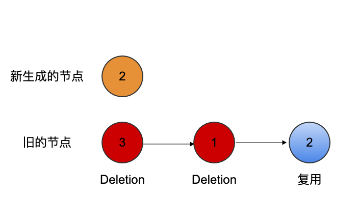

# Fiber树更新

在前边看了任务调度的过程，接下来进入更新的内容

```js
/**
 * 执行每个单元的work
 * @param {*} unitOfWork
 */
function performUnitOfWork(unitOfWork: Fiber): Fiber | null {
  // 取得工作备用的fiber对象
  const current = unitOfWork.alternate;
  let next;
  next = beginWork(current, unitOfWork, renderExpirationTime);
  unitOfWork.memoizedProps = unitOfWork.pendingProps;
  if (next === null) {
    // If this doesn't spawn new work, complete the current work.
    next = completeUnitOfWork(unitOfWork);
  }
  ReactCurrentOwner.current = null;
  return next;
}
```

这里就是对每一个fiber节点的child更新，直到到达了叶子节点执行`completeUnitOfWork`这个任务

## beginWork

这个方法终于能看到和我们平时写代码有一些相关的了，这个方法比较长就不在这里直接都列出来了,主要是判断props和context是否改变，如果没改变直接打上一个标记，直接跳过这个fiber返回当前的child，根据不同的组件类型进行不同的更新，这里只看两种也是用的最多的`functionComponent`和`classComponent`,

### functionComponent

这个方法的执行主要就是两步

1. 执行function渲染出子节点
2. 调和子节点

这里主要就要看一下调和子节点的过程
这里主要根据新生成的子节点的类型去走不同的逻辑去调和fiber节点

1. SingleElement
对于单个元素，会和之前的fiber进行比较，沿着fiber的sibling属性也就是链表的遍历一直遍历下去如果key不一样就删除，如果找到相同的key并且组件类型相同就会复用。如果都没找到就创建新的fiber对象
这里不是真正的删除而是在fiber对象上标记上一个effectTag为Deletion，在下一个阶段才会真正的删除。就像下边这张图一样。新生成的key为2，会按照顺序将除了2之外的都删除，复用2这个节点



2. ChildrenArray

对于返回的是数组元素采用的方法是

1. 如果是数组按顺序能复用的key就复用，在第一个不能复用的地方跳出更新，如果新数组遍历完就返回
2. 如果老的遍历完了，就将新的全部插入，连成一个链表
3. 都没遍历完，将老的变成一个map类型，新的children去老的中查找是否有能复用的，有就加入新的children
4. 最后将没用到的老的删除
