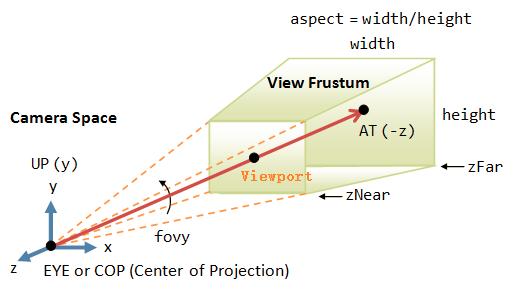
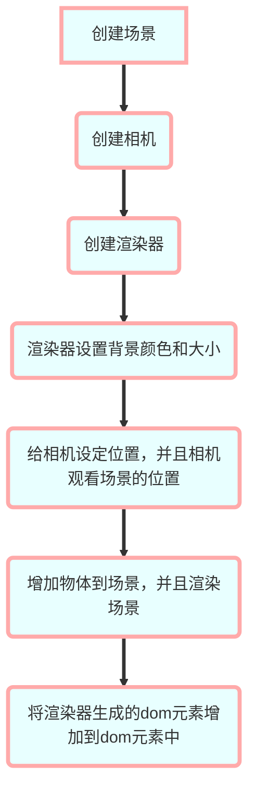

# 基本介绍

## 场景Scene

在使用three.js首先要创建的就是场景，是我们所有元素运行时的背景，所有内容都建立在场景之上，创建场景很简单`var scene = new THREE.Scene()`这样就可以创建场景了，在three.js中基本上所有的api都是这种面向对象接口，这样能更好的梳理逻辑。

## 相机Camera

相机是我们通过哪种视角来观察场景的意思，创建相机`var camera =new THREE.PerspectiveCamera(45, window.innerWidth/window.innerHeight, 0.1, 1000)`,几个参数分别是视口角度，场景比例，近景切面，远景切面看一下下边的图就明白了，近景切面和远景切面中间的绿色的部分是我们能看到的空间。这是最常用的一种相机，还有其他几种相机。后边会说
我们可以通过camera.position来调整相机的位置，和camera.rotation调整相机的角度



## 渲染器WebGlRender

渲染器是我们用来渲染场景和相机的通过`var renderer = new THREE.WebGLRenderer()`来生成渲染器实例，通过`renderer.render(scene,camera)`来渲染场景和相机生成canvas元素
我们最后可以用renderer.domElement挂载到div中

## 物体

在场景中我们需要添加一些物体例如长方体,基本生成所有物体都是这个规则，生成一个物体形状的实例，生成一个材质的实例，最后通过合成的方法生成一个最终的物体，我们可以通过调整position,rotation等调整物体的一些属性，最后需要将物体加入到场景中。材质有很多种后边我们会看到，MeshBasicMaterial是最基础的材质

```
var cubeGeomerty = new THREE.CubeGeometry(4,4,4) // 指定物体的形状
var cubeMaterial = new THREE.MeshBasicMaterial({ color: 0x7777ff })// 指定物体的材质
var cube = new THREE.Mesh(cubeGeomerty, cubeMaterial) // 生成一个物体实例
scene.add(cube) // 将物体加到场景中
```

## 灯光

在场景中添加灯光我们可以使用`var spotLight = new THREE.SpotLight(0xffffff)`来生成一个灯光的实例，可以指定灯光的颜色。这样还是达不到灯光的效果，因为我们没有选用能够接收光的材质，我们要把物体的材质换成MeshLambertMaterial类型，我们也可以调整灯光的光源的位置。

## 阴影shaodw

为了达到真实的场景，我们已经有了灯光，照射到物体上就需要有阴影，由于阴影是比较消耗性能的，默认是关闭阴影的，`renderer.shadowMap.enabled = true`需要打开渲染器的阴影功能，并且设置物体可以接收阴影例如平面需要接收阴影，长方体产生阴影`plane.receiveShadow = true;cube.castShadow = true`,

## 运动

想让物体动起来我们需要先改写一下渲染器的方法，在每一次重新渲染时我们改变物体的属性这里例子是沿x轴转动物体
```
function render(){
  stats.update() // 统计数据更新
  requestAnimationFrame(render) // 定时重绘页面
  cube.rotation.x += 0.02 // 转动方块
  renderer.render(scene,camera) // 渲染
}
```

## 总结

我们做了一个基本的three.js项目，在一个场景里使用了2个物体，并且设置了灯光和阴影，增加了物体的位置的一些移动
下边是所有代码


```
var stats = initStats()
var scene = new THREE.Scene()
var camera =new THREE.PerspectiveCamera(45, window.innerWidth/window.innerHeight, 0.1, 1000)
var renderer = new THREE.WebGLRenderer()
renderer.setClearColor(0xEEEEEE, 1.0)
renderer.setSize(window.innerWidth, window.innerHeight)
renderer.shadowMap.enabled = true
/**坐标系 */
var axes = new THREE.AxesHelper(20)
scene.add(axes)
/**平面 */
var planeGeometry = new THREE.PlaneGeometry(60, 20, 1, 1)
// var planeMaterial = new THREE.MeshBasicMaterial({ color: 0xffffff })
var planeMaterial = new THREE.MeshLambertMaterial({ color: 0xffffff })
var plane = new THREE.Mesh(planeGeometry, planeMaterial)
plane.rotation.x = -0.5*Math.PI
plane.position.x = 15
plane.position.y = 0
plane.position.z = 0
plane.receiveShadow = true
scene.add(plane)

var cubeGeomerty = new THREE.CubeGeometry(4,4,4) // 指定物体的形状
var cubeMaterial = new THREE.MeshBasicMaterial({ color: 0x7777ff })// 指定物体的材质
var cube = new THREE.Mesh(cubeGeomerty, cubeMaterial) // 生成一个物体实例
scene.add(cube) // 将物体加到场景中
cube.position.y = 4
cube.castShadow = true


var sphereGeometry = new THREE.SphereGeometry(4,20,20)
var sphereMaterial = new THREE.MeshLambertMaterial({ color: 0xff0000 })
var sphere = new THREE.Mesh(sphereGeometry,sphereMaterial)
sphere.position.x = 20
sphere.position.y = 4
sphere.castShadow = true
scene.add(sphere)

/**相机 */
camera.position.x = -30
camera.position.y = 40
camera.position.z = 30
camera.lookAt(scene.position)
/**灯光 */
var spotLight = new THREE.SpotLight(0xffffff)
spotLight.position.set(-100,60,-10)
spotLight.castShadow = true
scene.add(spotLight)
document.body.appendChild(renderer.domElement)
var step = 0
function render(){
  stats.update() // 统计数据更新
  requestAnimationFrame(render) // 定时重绘页面
  cube.rotation.x += 0.02 // 转动方块
  step += 0.04
  sphere.position.x = 20+(10*(Math.sin(step)))
  renderer.render(scene,camera) // 渲染
}
/**
  * 初始化统计模块
  */
function initStats(){
  var stats = new Stats()
  stats.setMode(0)
  stats.domElement.style.position = 'absolute'
  stats.domElement.style.left = '0px'
  stats.domElement.style.top = '0px'
  document.getElementById('Stats-output').append(stats.domElement)
  return stats
}
render()
```

我们来看一下一个场景的基本流程



