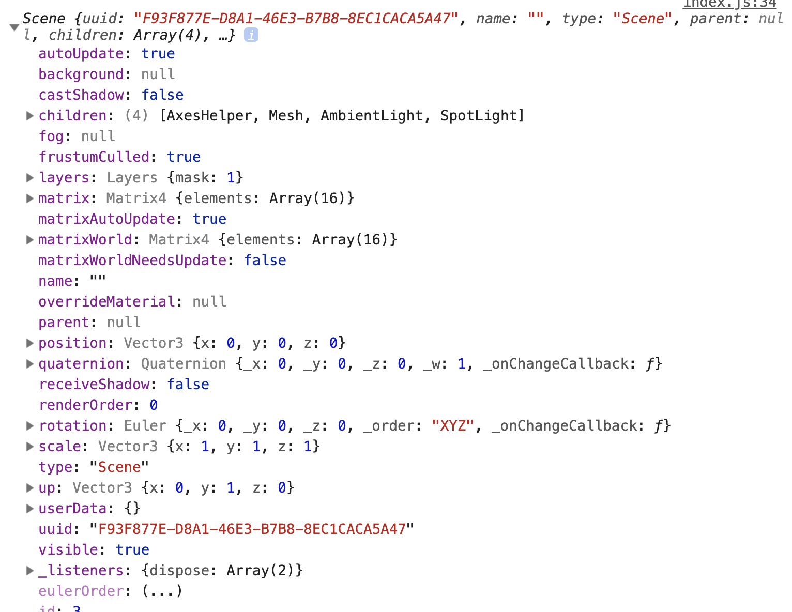

# 场景基本组成

我们所有的物体都是添加到场景中的，我们想通过场景操作物体有下边的api。我们来看一下scene对象所拥有的属性，我们可以看到所有的物体都存贮在一个children数组中

## 操作Api

- scene.add(cube) 在场景中增加物体
- scene.remove(cube) 在场景中删除物体
- scene.children 获取场景中的所有物体的数组
- scene.getObjectByName 根据物体名称获取物体
- scene.traverse(callback) 遍历所有的物体执行回调方法
- scene.overrideMaterial 覆盖所有物体的材质

## 雾化效果Fog

我们为场景增加一个雾化效果只需要`scene.fog = THREE.Fog(0xffffff, 0.05, 100);`这样就可以增加一个逐渐增强的雾化效果

## 摄像机

1. 正交投影相机 OrthographicCamera
很多2维游戏使用的投影方式，从哪个角度看长宽都一样

2. 透视相机 PerspectiveCamera
近大远小，和人的视角一样，比较真实的场景

