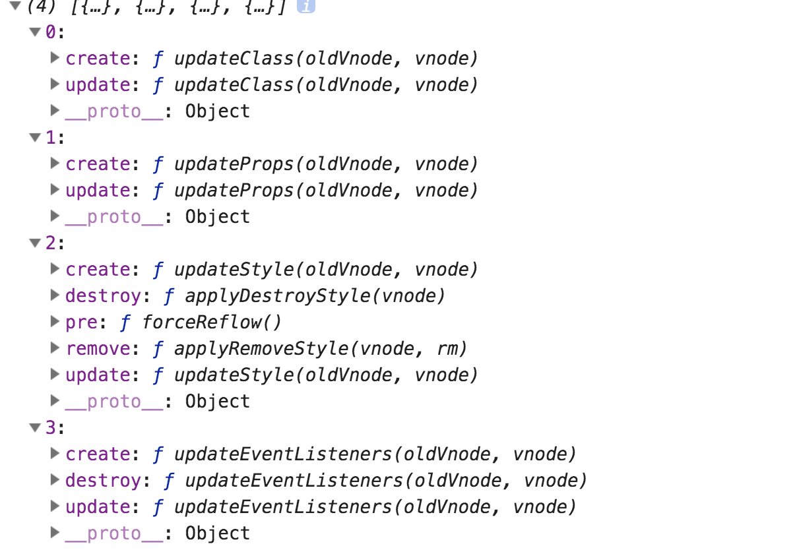

# snabbdom源码

现在流行的前端前端库都使用虚拟dom来提高dom渲染效率，简单的来说虚拟dom就是用js来模拟dom数据结构，js的运行速度是远快于dom的，每次改变通过js先更新，在通过diff算法来进行最小的更改，减小频繁的dom操作，从算法上来讲也是一种空间换时间的实现

## 使用

先来看一下官网上对使用的一些介绍，首先根据自己需要的模块组合生成一个patch方法，通过h函数定义一个vnode，
通过patch方法来将虚拟节点渲染到页面上
```
const snabbdom =require('snabbdom');
const { h, init } = snabbdom 
const patch = init([ // 可以自行定义虚拟dom支持的模块
  require('snabbdom/modules/class').default, // 支持class
  require('snabbdom/modules/props').default, // 支持prop
  require('snabbdom/modules/style').default, // 支持定义样式
  require('snabbdom/modules/eventlisteners').default // 支持事件监听方法
])
const root = document.getElementById('root')
function fnc() {
  console.log('click vnode')
}
const vnode = h('div#root',{ on: { click: fnc }}, 'this is a vnode') // 生成vnode
patch(root, vnode) // 执行patch，将虚拟dom渲染到页面上
const newnode = h('div#root',{ on: { click: fnc }}, 'this is a newnode')
patch(vnode, newnode) // 根据新旧虚拟dom重新渲染
```

## 虚拟dom

说到虚拟dom，其实就是一个js对象，里面存着渲染需要的一些字段，vue，react都有这样的对象，根据自己的业务，
使用不同的字段，先来看一下snabbdom的虚拟dom。相对于fiber对象，这个框架的字段都很精简而且是每个虚拟dom都必须拥有的

```
interface VNode {
  sel: string | undefined; // 标签选择字符串
  data: VNodeData | undefined; // 可以理解成react的props可以放class，style，on，attrs等来描述标签的功能
  children: Array<VNode | string> | undefined; // 节点中innerHtml的内容，可以是vNode递归渲染，也可以是字符串
  elm: Node | undefined; // 指向dom的真实节点
  text: string | undefined; // 渲染的字符串内容
  key: Key | undefined; // 唯一标识用来判断dom是否相同
}

```

## init方法

我们在看源码是一定要找到一个入口方法来看，这样会让我们很清晰的看到库的架构，首先来看看init方法
我们看一下snabbdom.ts入口文件，这个文件一共有三个方法，init方法在这里定义，核心代码一共也就300多行，在说这个之前我们先来看一下hooks的概念
这个hooks是钩子函数在不同的时期执行不同的函数我们来看一下官网的一些说明

| 名称         | 触发时机                                            | 回调参数                 |
| ----------- | --------------                                     | ----------------------- |
| `pre`       | the patch process begins                           | none                    |
| `init`      | a vnode has been added                             | `vnode`                 |
| `create`    | a DOM element has been created based on a vnode    | `emptyVnode, vnode`     |
| `insert`    | an element has been inserted into the DOM          | `vnode`                 |
| `prepatch`  | an element is about to be patched                  | `oldVnode, vnode`       |
| `update`    | an element is being updated                        | `oldVnode, vnode`       |
| `postpatch` | an element has been patched                        | `oldVnode, vnode`       |
| `destroy`   | an element is directly or indirectly being removed | `vnode`                 |
| `remove`    | an element is directly being removed from the DOM  | `vnode, removeCallback` |
| `post`      | the patch process is done                          | none                    |

看字面意思也能明白这些钩子的一些含义，我们在init中传入的依赖我们可以看一看到底是什么,我们在控制台打出这些依赖，
可以看到这些hooks都是对象，里边的方法分别对应着定义好的hooks，在每一个时期执行这些模块内定义好的方法



接下来看看init方法

```

// 参数为依赖模块的数组，支持的原生domapi例如appendChild，可以自行定义，不传使用默认的
function init(modules: Array<Partial<Module>>, domApi?: DOMAPI) {
  let i: number, j: number, cbs = ({} as ModuleHooks);

  const api: DOMAPI = domApi !== undefined ? domApi : htmlDomApi;
  // 将所有依赖的hook也就是module映射称map的形式，在每一个时期把对应的方法都添加到一个数组中
  for (i = 0; i < hooks.length; ++i) { 
    cbs[hooks[i]] = [];
    for (j = 0; j < modules.length; ++j) {
      const hook = modules[j][hooks[i]];
      if (hook !== undefined) {
        (cbs[hooks[i]] as Array<any>).push(hook);
      }
    }
  }
  // 将vnode清空我们可以看到直接清空的是vnode中的data，children这样就可以清空vnode
  function emptyNodeAt(elm: Element) { 
    const id = elm.id ? '#' + elm.id : '';
    const c = elm.className ? '.' + elm.className.split(' ').join('.') : '';
    return vnode(api.tagName(elm).toLowerCase() + id + c, {}, [], undefined, elm);
  }
  // 创建一个删除元素的方法
  function createRmCb(childElm: Node, listeners: number) {
    return function rmCb() {
      if (--listeners === 0) {
        const parent = api.parentNode(childElm);
        api.removeChild(parent, childElm);
      }
    };
  }
  // 创建dom元素
  function createElm(vnode: VNode, insertedVnodeQueue: VNodeQueue): Node {
    let i: any, data = vnode.data;
    if (data !== undefined) {
      if (isDef(i = data.hook) && isDef(i = i.init)) {
        i(vnode);
        data = vnode.data;
      }
    }
    let children = vnode.children, sel = vnode.sel;
    if (sel === '!') { // 创建注释
      if (isUndef(vnode.text)) {
        vnode.text = '';
      }
      vnode.elm = api.createComment(vnode.text as string);
    } else if (sel !== undefined) { // 创建dom元素
      // Parse selector
      const hashIdx = sel.indexOf('#'); // 是否有id
      const dotIdx = sel.indexOf('.', hashIdx); // .的位置
      const hash = hashIdx > 0 ? hashIdx : sel.length; 
      const dot = dotIdx > 0 ? dotIdx : sel.length;
      const tag = hashIdx !== -1 || dotIdx !== -1 ? sel.slice(0, Math.min(hash, dot)) : sel; // 选择传入的tag标签例如div，span
      const elm = vnode.elm = isDef(data) && isDef(i = (data as VNodeData).ns) ? api.createElementNS(i, tag)
                                                                               : api.createElement(tag);// 创建真实dom元素
      if (hash < dot) elm.setAttribute('id', sel.slice(hash + 1, dot)); // 设置id
      if (dotIdx > 0) elm.setAttribute('class', sel.slice(dot + 1).replace(/\./g, ' ')); // 设置class
      for (i = 0; i < cbs.create.length; ++i) cbs.create[i](emptyNode, vnode); // 执行cbs中的create数组中的hook方法
      // 在当前元素内插入子元素
      if (is.array(children)) { // 判断是不是数组
        for (i = 0; i < children.length; ++i) {
          const ch = children[i];
          if (ch != null) {
            api.appendChild(elm, createElm(ch as VNode, insertedVnodeQueue)); // 递归插入每一个元素
          }
        }
      } else if (is.primitive(vnode.text)) { // 判断是不是字符串或者数字
        api.appendChild(elm, api.createTextNode(vnode.text));
      }
      i = (vnode.data as VNodeData).hook; // Reuse variable
      if (isDef(i)) { // 执行vnode中data上的hook中的create和insert
        if (i.create) i.create(emptyNode, vnode);
        if (i.insert) insertedVnodeQueue.push(vnode);
      }
    } else { // sel为undefined时
      vnode.elm = api.createTextNode(vnode.text as string);
    }
    return vnode.elm;
  }
  // 在指定的vnode前插入元素
  function addVnodes(parentElm: Node,
                     before: Node | null,
                     vnodes: Array<VNode>,
                     startIdx: number,
                     endIdx: number,
                     insertedVnodeQueue: VNodeQueue) {
    for (; startIdx <= endIdx; ++startIdx) {
      const ch = vnodes[startIdx];
      if (ch != null) {
        api.insertBefore(parentElm, createElm(ch, insertedVnodeQueue), before);
      }
    }
  }
  // 执行vnode.data中的destroy hook
  function invokeDestroyHook(vnode: VNode) {
    let i: any, j: number, data = vnode.data;
    if (data !== undefined) {
      if (isDef(i = data.hook) && isDef(i = i.destroy)) i(vnode);
      for (i = 0; i < cbs.destroy.length; ++i) cbs.destroy[i](vnode);
      if (vnode.children !== undefined) {
        for (j = 0; j < vnode.children.length; ++j) {
          i = vnode.children[j];
          if (i != null && typeof i !== "string") {
            invokeDestroyHook(i);
          }
        }
      }
    }
  }
  // 删除vnode
  function removeVnodes(parentElm: Node,
                        vnodes: Array<VNode>,
                        startIdx: number,
                        endIdx: number): void {
    for (; startIdx <= endIdx; ++startIdx) {
      let i: any, listeners: number, rm: () => void, ch = vnodes[startIdx];
      if (ch != null) {
        if (isDef(ch.sel)) { // 区分是dom组件还是text组件
          invokeDestroyHook(ch); // 执行destory hook
          listeners = cbs.remove.length + 1;
          rm = createRmCb(ch.elm as Node, listeners);
          for (i = 0; i < cbs.remove.length; ++i) cbs.remove[i](ch, rm); // 执行cbs中remove hook
          if (isDef(i = ch.data) && isDef(i = i.hook) && isDef(i = i.remove)) { // 执行vnode中的remove hook
            i(ch, rm);
          } else {
            rm();
          }
        } else { // Text node
          api.removeChild(parentElm, ch.elm as Node); // 直接移除
        }
      }
    }
  }
}

```

- 可以看到在入口文件定义了对vnode的增删改方法，都是同时利用dom操作移除并且同步vnode
- init方法，入餐是依赖的hook数组，和一个可选的domapi，不传入的话会使用框架默认的基本domapi你也可以根据自己的业务重写这些api，这就增强了可扩展性
- 最后return了一个patch函数就是之前demo中那个patch方法，两个参数，第一个参数可以是dom类型，都可以是vnode类型
- 先执行cbs中的pre hook，如果是dom类型就生成一个空的vnode，之后比较两个vnode是否相同，如果相同就进行patchVnode修改，如果不同就把新的vnode移到旧的vnode的位置并且删除旧的vnode，这个和react中的diff算法思想是一样的，不用去递归的比较树中的每个节点每个属性，只要发现类型不同就移除重新生成dom，这样大大提高了比较的效率

## patchVnode

- 这个方法是实际上对new和oldvnode进行比较的方法，首先执行新的vnode的prepatch hook
- 取得elm属性并且一直保持2个形同，这个字段代表的是真实dom的对象
- 执行update hook
- 判断是不是文本
  1. 如果是移除旧的children，设为新的vnode。
  2. 不是的话又有四种情况
  - 新旧都含有children的话利用updateChildren深度遍历比较（这个后边会说）
  - 如果只有新的chilren有直接插入dom
  - 如果只有旧的chilren有直接删除dom
  - 如果都没有但旧的vnode有text直接删除text

- 最后执行postpatch hook

```

function patchVnode(oldVnode: VNode, vnode: VNode, insertedVnodeQueue: VNodeQueue) {
  let i: any, hook: any;
  if (isDef(i = vnode.data) && isDef(hook = i.hook) && isDef(i = hook.prepatch)) { // 执行prepatch hook
    i(oldVnode, vnode);
  }
  const elm = vnode.elm = (oldVnode.elm as Node); // 给new.elm赋值
  let oldCh = oldVnode.children; // old.children
  let ch = vnode.children; // new.children
  if (oldVnode === vnode) return; // 如果是同一个对象
  if (vnode.data !== undefined) { // 执行update hook
    for (i = 0; i < cbs.update.length; ++i) cbs.update[i](oldVnode, vnode);
    i = vnode.data.hook;
    if (isDef(i) && isDef(i = i.update)) i(oldVnode, vnode);
  }
  if (isUndef(vnode.text)) { // 如果没有text
    if (isDef(oldCh) && isDef(ch)) { // updatechildren
      if (oldCh !== ch) updateChildren(elm, oldCh as Array<VNode>, ch as Array<VNode>, insertedVnodeQueue);
    } else if (isDef(ch)) { // 如果只有new直接插入
      if (isDef(oldVnode.text)) api.setTextContent(elm, '');
      addVnodes(elm, null, ch as Array<VNode>, 0, (ch as Array<VNode>).length - 1, insertedVnodeQueue);
    } else if (isDef(oldCh)) { // 如果只有old则删除
      removeVnodes(elm, oldCh as Array<VNode>, 0, (oldCh as Array<VNode>).length - 1);
    } else if (isDef(oldVnode.text)) { // 都没有children但old.text 删除text
      api.setTextContent(elm, '');
    }
  } else if (oldVnode.text !== vnode.text) {
    if (isDef(oldCh)) { // 移除old.children
      removeVnodes(elm, oldCh as Array<VNode>, 0, (oldCh as Array<VNode>).length - 1);
    }
    api.setTextContent(elm, vnode.text as string);
  }
  if (isDef(hook) && isDef(i = hook.postpatch)) { // 执行postpatch hook
    i(oldVnode, vnode);
  }
}
```

## updateChilren

通过前边的分析可以看到，这个方法只有在新旧vnode相同但属性发生改变的情况。
实际上就是对两个vnode的children数组进行比较，以新数组为基准，如果我们直接把旧的删除，拆入新的这样做虽然简单，但如果没有改变，或者只有其中的几项发生了改变
那我们会做很多无谓的创建删除，如果只是位置改变就换位置，如果旧的没有插入，新的没有，就把旧的删除。主要的思想就是这样
如果我们直接遍历两个数组这样做效率很低需要n^2的时间，这里采用了4个指针遍历的方法我们来看一下

- 定义每个数组的首尾各一个指针，头部++，尾部--，执行while循环判断2个数组的头尾指针都没碰上的情况才执行
- 首先判断每个指针是不是指向null，直到每个指针都不指向null为止
- 如果头部指针相等执行patchVnode方法头指针后移,对dom不做修改
- 如果尾部指针相等执行patchVnode方法尾指针前移,对dom不做修改
- 如果old头指针等于new的尾指针，那么执行patchVnode更新并且修改dom将old头指针的vnode移动到old尾指针的位置，old头指针右移，new尾指针左移
- 如果old尾指针等于new的头指针，那么执行patchVnode更新并且修改dom将old尾指针的vnode移动到old头指针的位置，old尾指针左移，new头指针右移
- 以上情况都不满足了生成一个以old数组元素key为key，value为index的map类型对象，再用newVnode.key直接去map里边去取，这是一种以空间换时间的做法剩去了每次都要去遍历数组
  1. 如果没有就创建新的dom元素，插入到old头指针的位置
  2. 如果有的话就去判断old和new的sel是否相同，如果相同执行patchVnode更新并且将当前的dom插入到头指针的位置，不相同则直接创建新的元素在old头指针位置
- 当这个循环执行完之后再比较old和new哪个数组没有遍历完如果old没遍历完，证明剩下的多余了，都删调，反之将没遍历到的元素都添加进去

这下这个方法执行完了，虽然很复杂但两个数组只扫描了一遍，用O（n）的时间就完成了，而且没有改变的元素不会重新创建，只是更新移动位置更新属性

```
// 更新子组件
function updateChildren(parentElm: Node,
                        oldCh: Array<VNode>,
                        newCh: Array<VNode>,
                        insertedVnodeQueue: VNodeQueue) {
  let oldStartIdx = 0, newStartIdx = 0;
  let oldEndIdx = oldCh.length - 1;
  let oldStartVnode = oldCh[0];
  let oldEndVnode = oldCh[oldEndIdx];
  let newEndIdx = newCh.length - 1;
  let newStartVnode = newCh[0];
  let newEndVnode = newCh[newEndIdx];
  let oldKeyToIdx: any;
  let idxInOld: number;
  let elmToMove: VNode;
  let before: any;
  // 用4个指针来扫描2个数组进行比较
  while (oldStartIdx <= oldEndIdx && newStartIdx <= newEndIdx) {
    if (oldStartVnode == null) { // 直接跳过直到找到不为空的vnode start从前找，end从后找，下边4个判断都是
      oldStartVnode = oldCh[++oldStartIdx]; // Vnode might have been moved left
    } else if (oldEndVnode == null) { 
      oldEndVnode = oldCh[--oldEndIdx];
    } else if (newStartVnode == null) {
      newStartVnode = newCh[++newStartIdx];
    } else if (newEndVnode == null) {
      newEndVnode = newCh[--newEndIdx];
    } else if (sameVnode(oldStartVnode, newStartVnode)) { // sameVnode判断key和sel是否相等，两个前指针是否相等
      patchVnode(oldStartVnode, newStartVnode, insertedVnodeQueue);
      oldStartVnode = oldCh[++oldStartIdx];
      newStartVnode = newCh[++newStartIdx];
    } else if (sameVnode(oldEndVnode, newEndVnode)) { // 两个后指针是否相等
      patchVnode(oldEndVnode, newEndVnode, insertedVnodeQueue);
      oldEndVnode = oldCh[--oldEndIdx];
      newEndVnode = newCh[--newEndIdx];
    } else if (sameVnode(oldStartVnode, newEndVnode)) { // Vnode moved right old数组的前指针=new的末尾，
      patchVnode(oldStartVnode, newEndVnode, insertedVnodeQueue);
      api.insertBefore(parentElm, oldStartVnode.elm as Node, api.nextSibling(oldEndVnode.elm as Node)); // 将start指向元素移到end指针前边，向右移动，将old中start位置移动到new中end的位置
      oldStartVnode = oldCh[++oldStartIdx];
      newEndVnode = newCh[--newEndIdx];
    } else if (sameVnode(oldEndVnode, newStartVnode)) { // Vnode moved left old的end=new的start
      patchVnode(oldEndVnode, newStartVnode, insertedVnodeQueue);
      api.insertBefore(parentElm, oldEndVnode.elm as Node, oldStartVnode.elm as Node); // 将end移动到start前边，向左移动，将old的end移动到对应的strat位置
      oldEndVnode = oldCh[--oldEndIdx];
      newStartVnode = newCh[++newStartIdx];
    } else {
      if (oldKeyToIdx === undefined) {
        oldKeyToIdx = createKeyToOldIdx(oldCh, oldStartIdx, oldEndIdx); // map类型key为oldch的key值，value为数组的索引
      }
      idxInOld = oldKeyToIdx[newStartVnode.key as string];// 取得new中key在old中的索引
      if (isUndef(idxInOld)) { // New element
        api.insertBefore(parentElm, createElm(newStartVnode, insertedVnodeQueue), oldStartVnode.elm as Node);
        newStartVnode = newCh[++newStartIdx];
      } else { // 说明已存在
        elmToMove = oldCh[idxInOld]; // 取得当前的node
        if (elmToMove.sel !== newStartVnode.sel) { // 如果vnode的sel选择器不一样，创建一个新的元素在old start的位置
          api.insertBefore(parentElm, createElm(newStartVnode, insertedVnodeQueue), oldStartVnode.elm as Node)
        } else { // 将old中的位置插到当前start的位置
          patchVnode(elmToMove, newStartVnode, insertedVnodeQueue);
          oldCh[idxInOld] = undefined as any;
          api.insertBefore(parentElm, (elmToMove.elm as Node), oldStartVnode.elm as Node);
        }
        newStartVnode = newCh[++newStartIdx];
      }
    }
  }
  if (oldStartIdx <= oldEndIdx || newStartIdx <= newEndIdx) { // 当old和new长度不一样时有2种情况
    if (oldStartIdx > oldEndIdx) { // 当old不满足说明new还没有遍历完所以批量添加
      before = newCh[newEndIdx+1] == null ? null : newCh[newEndIdx+1].elm;
      addVnodes(parentElm, before, newCh, newStartIdx, newEndIdx, insertedVnodeQueue);
    } else { // old还没有遍历完，说明new已经遍历完了，移除old中的元素
      removeVnodes(parentElm, oldCh, oldStartIdx, oldEndIdx);
    }
  }
}

```

## h方法

在前边demo中可以看到这个方法是用来创建vnode的，这个方法很简单我们来看一下,主要就是根据传入的参数来判断
生成vnode的几个参数，前边有说明，可以对应看一下

```
function h(sel: any, b?: any, c?: any): VNode {
  var data: VNodeData = {}, children: any, text: any, i: number;
  if (c !== undefined) {
    data = b;
    if (is.array(c)) { children = c; }
    else if (is.primitive(c)) { text = c; }
    else if (c && c.sel) { children = [c]; }
  } else if (b !== undefined) {
    if (is.array(b)) { children = b; }
    else if (is.primitive(b)) { text = b; }
    else if (b && b.sel) { children = [b]; }
    else { data = b; }
  }
  if (children !== undefined) {
    for (i = 0; i < children.length; ++i) {
      if (is.primitive(children[i])) children[i] = vnode(undefined, undefined, undefined, children[i], undefined);
    }
  }
  if (
    sel[0] === 's' && sel[1] === 'v' && sel[2] === 'g' &&
    (sel.length === 3 || sel[3] === '.' || sel[3] === '#')
  ) {
    addNS(data, children, sel);
  }
  return vnode(sel, data, children, text, undefined);
};
```

## hooks

前边简单说过hooks是什么，这种设计模式帮我们做了模块化的功能，库的开发者定义好每个hook应该在什么时候触发，当我们使用的时候，
可以自己根据需要来组合使用，其中的细节在每个hook定义的时候已经决定了，比起面向对象来说，这种更像面向过程编程，这种方法比我们把代码按照流程一步一步用function嵌套起来，
代码结构很清晰而且易扩展，这里我们来具class来说明一下，其他的hook也类似都是比较前后的data从而做一些更新

1. class

这个hook在create和update时执行，其实很简单就是比较第二个参数传入的data如果新的没有就加入没有就删除
```

updateClass(oldVnode: VNode, vnode: VNode): void {
  var cur: any, name: string, elm: Element = vnode.elm as Element,
      oldClass = (oldVnode.data as VNodeData).class,
      klass = (vnode.data as VNodeData).class;

  if (!oldClass && !klass) return;
  if (oldClass === klass) return;
  oldClass = oldClass || {};
  klass = klass || {};

  for (name in oldClass) {
    if (!klass[name]) {
      elm.classList.remove(name);
    }
  }
  for (name in klass) {
    cur = klass[name];
    if (cur !== oldClass[name]) {
      (elm.classList as any)[cur ? 'add' : 'remove'](name);
    }
  }
}

```
