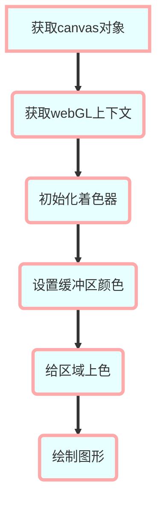

# webGL

在html中想要绘制3维图形，都是利用canvas来实现的，webGL为我们提供了接口来绘制图形我们来看一下基本的代码

```
// 顶点着色器
var VSHADER_SOURCE = 'void main(){\n'+
' gl_Position = vec4(0.0, 0.0, 0.0, 1.0);\n'+ // 含有4个浮点数的变量表示位置，前3个表示X，Y，Z坐标。当第4个是1.0时位置就是（X,Y,Z）
' gl_PointSize = 10.0;\n'+ // 浮点数表示大小
'}\n'
// 片元着色器
var FSHADER_SOURCE = 'void main(){\n'+
' gl_FragColor = vec4(1,0,0,1);\n'+ // 表示颜色的变量
'}\n'
function main(){
  var canvas = document.getElementById("web")
  var gl = getWebGLContext(canvas)
  if(!initShaders(gl, VSHADER_SOURCE, FSHADER_SOURCE)){ // 初始化着色器
    console.log('init error')
    return
  }
  gl.clearColor(0.0,0.0,1.0,1.0) // 设置颜色
  gl.clear(gl.COLOR_BUFFER_BIT) // 将区域用指定颜色上色
  gl.drawArrays(gl.POINTS, 0 ,1) // 绘制点
}
```
来看一下大概的webGL绘制流程图



## 着色器

着色器是webGL很重要一个概念，有2中着色器

- 顶点着色器 表示需要渲染图形的位置和大小
- 片元着色器 表示需要渲染图形的颜色
需要用字符串的方式传给webGL来使用

## 坐标系

webGL使用的是右手坐标系水平方向x轴，垂直方向y，z垂直屏幕

## 定义变量

之前都是硬编码的方法把图形的大小颜色写固定的值，想通过js来控制需要这么做
- 通过`attribute vec4 a_Position`来定义一个顶部着色器变量vec4是类型，后边是变量名称，通过getAttribLocation来过去program中存储的着色器地址，通过vertexAttrib3f来设置变量的值

- 通过`uniform vec4 u_FragColor`来定义片元着色器，同样获得值和设置的值如下

```
// 顶点着色器
var VSHADER_SOURCE = ' attribute vec4 a_Position;\n'+
' attribute float a_PointSize;\n'+
'void main(){\n'+
' gl_Position = a_Position;\n'+ // 含有4个浮点数的变量表示位置，前3个表示X，Y，Z坐标。当第4个是1.0时位置就是（X,Y,Z）
' gl_PointSize = a_PointSize;\n'+ // 浮点数表示大小
'}\n'
// 片元着色器
var FSHADER_SOURCE = 'precision mediump float;\n' +
'uniform vec4 u_FragColor;\n' +
  'void main(){\n'+
' gl_FragColor = u_FragColor;\n'+ // 表示颜色的变量
'}\n'
var a_Position = gl.getAttribLocation(gl.program, 'a_Position')
var a_PointSize = gl.getAttribLocation(gl.program, 'a_PointSize')
var u_FragColor = gl.getUniformLocation(gl.program, 'u_FragColor')
gl.vertexAttrib3f(a_Position, 0.0, 0.0, 0.0)
gl.vertexAttrib1f(a_PointSize, 10.0)
gl.uniform4f(u_FragColor, 1.0, 0.0, 0.0, 1.0)
```