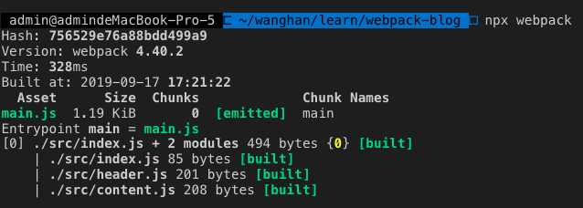

# wbepack4

webpack是一款模块打包器，可以解决前端工程化中引入依赖资源等一些列问题

## start启动打包

每一个webpack工程都要有一个或多个配置文件默认是webpack.config.js，我们也可以执行命令`webpack --config [name].js`来执行自定义文件名的配置文件,在文件中我们使用commonjs规范导出我们的配置参数例如下边这个简单的事例，其实就是webpack会根据我们导出的对象来解析合并一些默认配置来打包各个资源，webpack4中为了简化我们的开发增加大量的默认配置

```javascript
module.exports = {
  entry:'index.js'
}
```

## entry入口

我们打包文件都要有一个入口文件，就是我们要以一个入口文件开始递归的将依赖的资源全都打包到一起我们看一下基本的配置,和一个最简单的demo,我们使用es6的模块化方式来加载模块，这在浏览器中是不被识别的，我们执行`npx webpack`命令，默认打包输出在`./dist`目录下，我们定义入口的key就是我们生成文件的名字，我们看一下打包输出信息。


- 打包多文件我们可以定义多个入口,这也是多页面打包常用的方法
- 我们也可以将入口传入的文件路径改成一个数组,这样会将多个入口文件的依赖打包成一个文件，这也是我们在实践中常用的将一些第三方依赖打包在一起的方法

```javascript
// webpack.config.js
module.exports = {
  entry:{
    main: 'index.js',
  }
}
// index.js
import Header from './header';
import Content from './content';

Header();
Content();

// header.js
function Header(){
  const root = document.getElementById('root');
  const header = document.createElement('header');
  header.innerText = 'header';
  root.appendChild(header);
}

export default Header

//content.js
function Content(){
  const root = document.getElementById('root');
  const content = document.createElement('content');
  content.innerText = 'content';
  root.appendChild(content);
}

export default Content
```

## output

上边定义文件打包的入口,我们可以定义output参数来定义我们打包的生成目录地址，我们可以使用占位符来定义我们生成文件的名字，也可以定义路径及我们将文件上传cdn后自动给我们加上域名前缀

```javascript
module.exports = {
  entry: {
    main: path.join(__dirname, './src/index.js'),
  },
  output:{
    filename: '[name]-[hash].js', // 占位符定义输出名称
    path: path.join(__dirname, "./build"), // 输出的文件夹
    publicPath: 'http://www.xxx.com' // 文件上传cdn的公共前缀
  }
}
```

## loader加载器

我们可以利用webpack来打包各种资源就是依赖于loader，我们可以对各种类型的文件采用不同的方式生成bundle模块，webpack默认只会给我们加载js文件，剩下所有类型的文件都需要我们自己来处理。
我们来使用一个module属性中添加一条rules规则，常用test来匹配文件后缀，use来指定使用的loader，可以是一个字符串或者数组，数组表示我们将利用链式规则处理这种资源文件

### css-loader

我们来看一个例子，我们在入口文件引入一个css文件如果我们不对css文件增加loader，默认是打包失败的，提示我们应该添加一个loader来处理这种文件，我们添加了2个loader来处理css文件，style-loader表示我们将处理好的css文件插入到js文件的head中，css-loader是真正用来解析css文件的。

```javascript
import Header from './header';
import Content from './content';
import './css/index.css';

Header();
Content();

// webpack.config.js
module.exports = {
  module:{
    rules: [
      {
        test: /\.css$/,
        use: [
          {loader: 'style-loader'},
          {
            loader: 'css-loader'
          }
        ]
      }
    ]
  }
}
```

在工程实践中，我们像上边这样使用会有些问题，我们在全局引入可能会有样式重名，css样式庞大之后各种css权重优先级的问题，在webpack中已经给我们提供了解决方案，我们只需要在css-loader中新增加一个配置项,像下边这样,添加options为true这样在引入css时,我们将css导出给一个变量，这样在页面中css会生成一个基于md5的css名称解决了重名的问题

```javascript
module.exports = {
  module:{
    rules: [
      {
        test: /\.css$/,
        use: [
          {loader: 'style-loader'},
           {
            loader: 'css-loader',
            options: {
              modules: true
            }
          }
        ]
      }
    ]
  }
}
// header.js
import css from './css/header.css'

function Header(){
  const root = document.getElementById('root');
  const header = document.createElement('header');
  header.className = css.title
  header.innerText = 'header';
  root.appendChild(header);
}
```

### url-loader

我们在加载一些静态资源时可以使用file-loader来帮我们打包文件，常用来加载图片会使用这个url-loader，可以为我们将小图片转为base64编码

```javascript
module.exports = {
  module:{
    rules: [
       {
        test: /\.(jpg|png)$/,
        use: {
          loader: 'url-loader',
          options:{
            limit: 10240, // 小于大小限制的图片转为base64
          }
        }
      }
    ]
  }
}
```

## plguins插件

我们在打包过程中会使用插件帮我们做上边无法实现的一些功能，先来简单介绍一下，我们定义在plugins属性中，我们在打包时都是以js文件为入口我们要显示页面最终都要将js插入到html中，如果我们都等打好包后，再修改引入文件的名称是一件很麻烦的事，我们可以使用插件来帮我们完成这件事,我们使用生成的js经常是将代码拆入到一个跟标签中，所以我们可以定义一个template属性来指定html的模版，会在output的目录为我们生成一个html并将js都拆入好

```javascript
module.exports = {
  plugins: [
    new HtmlWebpackPlugin({
      template: path.resolve(__dirname, './index.html')
    })
  ]
}
```

## source-map

我们使用devtool属性来配置source-map，webpack帮我们打包了代码，我们在开发中需要调试代码,在mode为development默认会为我们开启inline-source-map，也就是我们打包前的文件与打包后生成代码的映射关系，所以当代码出错时我们可以在对应的行数找到我们的代码，在mode为production时会为我们设为none来减少我们打包我们代码的体积，关于这个字段有很多配置项可以去官网上查看，基于最佳实践，在开发模式下我们使用`cheap-module-eval-source-map`这样会为我们保持原有代码并且rebuid速度也快

## webpack-dev-server

在之前我们每次修改了代码我们都需要手动build一遍代码这样很不方便，webpack官方给我提供了内置的属性devServer来实现开发模式自动重新build功能，会监听文件的变化然后自动为我们打包刷新页面

```javascript
module.exports = {
  devServer: {
    contentBase: './build', // 将这个目录下的文件允许在端口下访问
    port: 8000, // 设置访问端口
    open: true, // 自动为我们打开浏览器
  },
}
```

我们看看来实现一个简单的devServer服务，我们需要先安装express和webpack-dev-middleware,webpack-dev-middleware可以将监听文件的修改然后将文件重新打包传给node服务，我们启动`node devServer.js`在3000端口就能实现和devServer看起来一样的功能，webpack-dev-server还有很多高级功能不是这么简单，这也是webpack运行在node端的一种实现

```javascript
// devServer.js
const express = require("express");
const WebpackDevMiddleware= require("webpack-dev-middleware");
const webpack = require("webpack");
const config = require("./webpack.config.js");

const app = express();
const compiler = webpack(config); // 编译代码

app.use(WebpackDevMiddleware(compiler)) // 将打包好的代码交给服务器

app.listen(3000, () => {
  console.log("server is start")
})
```

## HMR热更新

在开发中我们dev-server中帮我们实现了重新打包的功能,但我们在开发时我们想实现不刷新，维持浏览器现有状态更新代码，我们需要这样更新配置,将devServer中hot设为true并加入热更新插件，当我们这样配置完成后引入的css可以自动完成热更新，这样因为css-loader已经帮我们编写了热更新代码，对于js文件我们要自己监听文件的变化，当文件变化时我们要自己处理如何去热更新代码，在react，vue中社区已经

```javascript
module.exports = {
  devServer: {
    contentBase: './build', // 将这个目录下的文件允许在端口下访问
    port: 8000, // 设置访问端口
    hot: true,
  },
  plugins: [
    new webpack.NamedModulesPlugin(),
    new webpack.HotModuleReplacementPlugin()
  ]
}

// index.js
if(module.hot){ // 判断是否开启热更新
  module.hot.accept("./header.js", () => { // 监听文件是否变化，变化执行回调函数
    Header();
  })
}
```

## babel代码转换

在我们编写代码时我们经常会使用es6的语法，chrome浏览器能识别，但有些浏览器或手机浏览器不能识别这些高级语法，我们需要将代码转换成在哪里都可以运行的代码就要借助babel了，写.jsx文件时我们，我们也需要将代码转化浏览器能识别的我们借助的也是babel来帮我编译我们先看一下基础的配置,我们可以按照官网的配置先安装几个依赖 `npm install --save-dev babel-loader @babel/core @babel/preset-env npm install --save @babel/polyfill`。我们忽略的node_modules文件夹中的文件，使用babel-loader来处理js，我们还要定义我们要使用什么规则来处理,我们在入口文件引入`import "@babel/polyfill";`来在window下帮我们生成一些hock语法.

```javascript
module.exports = {
  module:{
    rules: [
      {
        test: /\.js$/,
        exclude: /nodu_modules/,
        use: "babel-loader"
      },
    ]
  },
}

// .babelrc
{
  "presets": [
    [
      "@babel/preset-env"
    ]
  ]
}
```

像上边这样使用我们会将整个polyfill文件都打包到我们的文件中，官方给我提供了一个参数可以来实现按需打包的配置如下,这样可以将我们的包体积减小很多,当我们这样配置时，我们可以不用在代码里引入polyfill文件，会自动为我们引入

```json
// .babelrc
{
  "presets": [
    [
      "@babel/preset-env",{
        "useBuiltIns": "usage"
      }
    ]
  ]
}
```

我们可以添加targets参数来指定我们打包浏览器的版本，这样会只能给我们将polyfill的代码打包进去

如果我们只是在业务中使用babel这样没有问题，但我们在开发类库的时候，会在window上污染全局变量，babel也给我们提供了解决方案`npm install --save-dev @babel/plugin-transform-runtime npm install --save @babel/runtime`,这样就不会污染我们的全局变量

```json
{
  "plugins": [
    [
      "@babel/plugin-transform-runtime",
      {
        "absoluteRuntime": false,
        "corejs": 2,
        "helpers": true,
        "regenerator": true,
        "useESModules": false
      }
    ]
  ]
}
```
