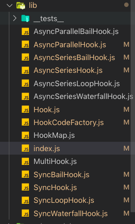

# tapable

tapable 是 webpack 源码中到处可以看到的的一个事件处理机制，根本的设计思想就是发布订阅模式。看看 github 上的描述`Just a little module for plugins.`,主要是用来实现插件机制的。我们想要在插件在那个时期执行，怎样执行都依赖于这个模块

## 主要用法

对于 tapable 的用法网上有很多资料去介绍我这里就不去说了附上一个连接[tapable 用法](https://www.jianshu.com/p/273e1c9904d2),主要就是将事件触发分为大概 3 种机制，同步执行，异步并发执行和异步排队阻塞执行

## 核心模块

我们从入口文件开始看起，先看一下目录结构

入口文件是 index.js 这个文件里只是将我们需要的模块做了一个整合并导出
**我们先从一个简单的同步顺序执行的 hook 开始看起**我在一些主要方法上都加了注释，导出的是一个基于 Hook 生成对象，并重写了一些对象上的属性。

- tapAsync，tapPromise 是异步触发的方法所以这里重写一下防止错误的调用
- 还有一个主要的 compile 方法是基于`HookCodeFactory`这个工厂函数生成的，这是这个库中最核心的代码
- 针对每一个 hook 都会继承这个工厂方法并重写 content 方法，后边会看到这里其实就是使用不同的方式去触发事件
- 在最后我放了一个方法是生成的 call 函数，用来触发事件，后边会解释

```javascript
// SyncHook.js
"use strict";

const Hook = require("./Hook");
const HookCodeFactory = require("./HookCodeFactory");

class SyncHookCodeFactory extends HookCodeFactory {
  content({ onError, onDone, rethrowIfPossible }) {
    // 具体执行事件触发的主要方法
    return this.callTapsSeries({
      // 执行factory中的排队执行注册函数
      onError: (i, err) => onError(err),
      onDone,
      rethrowIfPossible
    });
  }
}

const factory = new SyncHookCodeFactory();

// 在同步方法中重写异步方法使其失效
const TAP_ASYNC = () => {
  throw new Error("tapAsync is not supported on a SyncHook");
};
// 在同步方法中重写异步方法使其失效
const TAP_PROMISE = () => {
  throw new Error("tapPromise is not supported on a SyncHook");
};

const COMPILE = function(options) {
  factory.setup(this, options);
  return factory.create(options);
};

// 同步hook
function SyncHook(args = [], name = undefined) {
  const hook = new Hook(args, name);
  hook.constructor = SyncHook;
  hook.tapAsync = TAP_ASYNC;
  hook.tapPromise = TAP_PROMISE;
  hook.compile = COMPILE;
  return hook;
}

SyncHook.prototype = null;

module.exports = SyncHook;

/**
 * 生成call方法的工厂函数
 * 这是打印出来的一个例子
 */
function anonymous(arg1, arg2) {
  "use strict";
  var _context;
  var _x = this._x;
  var _fn0 = _x[0];
  _fn0(arg1, arg2);
  var _fn1 = _x[1];
  _fn1(arg1, arg2);
}
```

我们来看一下真正的每个 hook 的类 Hook,我们会用到 tap 方法来注册事件，然后使用 call 方法来触发事件，针对所有的 hook 所有的 tap 方法除了 type 不一样基本上流程都差不多，看明白了这个基本上都明白了，我对一些关键字段都加了说明。

- tap 触发的函数，都会保存到 taps 的数组中以供触发时使用，taps 中保存了触发函数，还保存了事件名称和事件类型，\_x 中只保存了注册的回调函数我们在上班看到触发时也是直接使用\_x 这个数组。
- 我们主要来看一下 compile 这个方法，这个方法在每个 hook 中都会被重写，他最终会调用每个 hook 的工厂函数来生成一个方法，我们下边就来看看这个工厂方法

```javascript
// Hook.js
"use strict";

const util = require("util");

const deprecateContext = util.deprecate(() => {},
"Hook.context is deprecated and will be removed");

// call函数的生成方法
const CALL_DELEGATE = function(...args) {
  this.call = this._createCall("sync");
  console.log(this.call.toString());
  return this.call(...args);
};
const CALL_ASYNC_DELEGATE = function(...args) {
  this.callAsync = this._createCall("async");
  console.log(this.callAsync.toString());
  return this.callAsync(...args);
};
const PROMISE_DELEGATE = function(...args) {
  this.promise = this._createCall("promise");
  return this.promise(...args);
};

class Hook {
  constructor(args = [], name = undefined) {
    this._args = args; // 初始化传入的数组参数
    this.name = name; // 定义hook的名称可以不传
    this.taps = []; // 保存注册事件的所有参数的数组包括type，options,fn
    this.interceptors = []; // 拦截器
    this._call = CALL_DELEGATE; // 私有的call方法
    this.call = CALL_DELEGATE; // 暴露的call方法
    this._callAsync = CALL_ASYNC_DELEGATE;
    this.callAsync = CALL_ASYNC_DELEGATE;
    this._promise = PROMISE_DELEGATE;
    this.promise = PROMISE_DELEGATE;
    this._x = undefined; // 保存注册回调函数的数组

    this.compile = this.compile;
    this.tap = this.tap;
    this.tapAsync = this.tapAsync;
    this.tapPromise = this.tapPromise;
  }

  // 编译生成call方法的接口，不继承会报错，js模拟面向接口编程
  compile(options) {
    throw new Error("Abstract: should be overridden");
  }

  // 生成call方法的中间方法
  _createCall(type) {
    return this.compile({
      taps: this.taps,
      interceptors: this.interceptors,
      args: this._args,
      type: type
    });
  }

  // 真正触发的注册事件方法
  _tap(type, options, fn) {
    // 检查传入的参数如果是字符串转为对象
    if (typeof options === "string") {
      options = {
        name: options
      };
    } // 检查options的类型必须为对象，并且必须有一个name字段
    else if (typeof options !== "object" || options === null) {
      throw new Error("Invalid tap options");
    }
    if (typeof options.name !== "string" || options.name === "") {
      throw new Error("Missing name for tap");
    }
    if (typeof options.context !== "undefined") {
      deprecateContext();
    }
    // 将需要的参数事件type，和回调函数合并到options中
    options = Object.assign({ type, fn }, options);
    // 运行拦截器的注册方法对options进行过滤
    options = this._runRegisterInterceptors(options);
    // 将注册的options加入tabs数组中以待之后使用
    this._insert(options);
  }

  // 暴露的注册事件方法
  tap(options, fn) {
    this._tap("sync", options, fn);
  }

  tapAsync(options, fn) {
    this._tap("async", options, fn);
  }

  tapPromise(options, fn) {
    this._tap("promise", options, fn);
  }

  // 运行拦截器对options进行过滤
  _runRegisterInterceptors(options) {
    for (const interceptor of this.interceptors) {
      if (interceptor.register) {
        const newOptions = interceptor.register(options);
        if (newOptions !== undefined) {
          options = newOptions;
        }
      }
    }
    return options;
  }

  withOptions(options) {
    const mergeOptions = opt =>
      Object.assign({}, options, typeof opt === "string" ? { name: opt } : opt);

    return {
      name: this.name,
      tap: (opt, fn) => this.tap(mergeOptions(opt), fn),
      tapAsync: (opt, fn) => this.tapAsync(mergeOptions(opt), fn),
      tapPromise: (opt, fn) => this.tapPromise(mergeOptions(opt), fn),
      intercept: interceptor => this.intercept(interceptor),
      isUsed: () => this.isUsed(),
      withOptions: opt => this.withOptions(mergeOptions(opt))
    };
  }
  // 判断当前hooks是否被使用
  isUsed() {
    return this.taps.length > 0 || this.interceptors.length > 0;
  }

  intercept(interceptor) {
    this._resetCompilation();
    this.interceptors.push(Object.assign({}, interceptor));
    if (interceptor.register) {
      for (let i = 0; i < this.taps.length; i++) {
        this.taps[i] = interceptor.register(this.taps[i]);
      }
    }
  }

  // 重置用来触发hook的函数
  _resetCompilation() {
    this.call = this._call;
    this.callAsync = this._callAsync;
    this.promise = this._promise;
  }

  // 将注册的事件加入tabs数组中，再插入前，由于经过拦截器的过滤所以重置触发方法
  _insert(item) {
    this._resetCompilation();
    let before;
    if (typeof item.before === "string") {
      before = new Set([item.before]);
    } else if (Array.isArray(item.before)) {
      before = new Set(item.before);
    }
    let stage = 0;
    if (typeof item.stage === "number") {
      stage = item.stage;
    }
    let i = this.taps.length;
    while (i > 0) {
      i--;
      const x = this.taps[i];
      this.taps[i + 1] = x;
      const xStage = x.stage || 0;
      if (before) {
        if (before.has(x.name)) {
          before.delete(x.name);
          continue;
        }
        if (before.size > 0) {
          continue;
        }
      }
      if (xStage > stage) {
        continue;
      }
      i++;
      break;
    }
    this.taps[i] = item;
  }
}

Object.setPrototypeOf(Hook.prototype, null);

module.exports = Hook;
```

这里代码比较多，所有触发事件的方法都在这里，我们可以先不看别的，直接看 create 方法，这里生成函数不是直接我们写代码时，直接根据参数去执行业务逻辑，使用了 es6 的`Function`构造函数来生成函数，这个方法接受 2 个参数，一个是函数的参数，一个是函数体，这样我们直接可以使用字符串来生成函数。

- 我们顺着代码去看可以先看 args()这个方法，这是根据我们传入的参数，将参数转成字符串的方法
- 然后是 header(),这个方法主要就是根据参数来初始化不同我们需要用到的变量
- 最后是主要的函数执行逻辑也是之前看到的在 SyncHook 中重写的 content 的方法，具体逻辑我们还要跳回上边看一下是怎样执行的，调用了 callTapsSeries 这个方法表示排队执行每个事件
- 我们来看一下这个方法也在 factory 中，我在代码中注释了主要的逻辑，这个方法就会生成一个函数我在 SyncHook 中添加的 anonymous 方法就是我写的一个例子在浏览器中打印出来的，可以看到他会同步在数组中取出回调并执行

```javascript
// HookCodeFactory.js
"use strict";
/**
 * Hook的生成工厂
 */
class HookCodeFactory {
  constructor(config) {
    this.config = config;
    this.options = undefined;
    this._args = undefined;
  }

  /**
   * 根据传入的参数生成call函数的方法
   * @param {taps,interceptors,args,type} options
   */
  create(options) {
    // 将hook的参数传给工厂函数
    this.init(options);
    let fn;
    switch (this.options.type) {
      case "sync":
        fn = new Function(
          this.args(),
          '"use strict";\n' +
            this.header() +
            this.content({
              onError: err => `throw ${err};\n`, // 处理错误情况的代码
              onResult: result => `return ${result};\n`, // 处理返回值的基础代码
              resultReturns: true, // 是否返回结果
              onDone: () => "", //
              rethrowIfPossible: true
            })
        );
        break;
      case "async":
        fn = new Function(
          this.args({
            after: "_callback"
          }),
          '"use strict";\n' +
            this.header() +
            this.content({
              onError: err => `_callback(${err});\n`,
              onResult: result => `_callback(null, ${result});\n`,
              onDone: () => "_callback();\n"
            })
        );
        break;
      case "promise":
        let errorHelperUsed = false;
        const content = this.content({
          onError: err => {
            errorHelperUsed = true;
            return `_error(${err});\n`;
          },
          onResult: result => `_resolve(${result});\n`,
          onDone: () => "_resolve();\n"
        });
        let code = "";
        code += '"use strict";\n';
        code += "return new Promise((_resolve, _reject) => {\n";
        if (errorHelperUsed) {
          code += "var _sync = true;\n";
          code += "function _error(_err) {\n";
          code += "if(_sync)\n";
          code += "_resolve(Promise.resolve().then(() => { throw _err; }));\n";
          code += "else\n";
          code += "_reject(_err);\n";
          code += "};\n";
        }
        code += this.header();
        code += content;
        if (errorHelperUsed) {
          code += "_sync = false;\n";
        }
        code += "});\n";
        fn = new Function(this.args(), code);
        break;
    }
    this.deinit();
    return fn;
  }

  setup(instance, options) {
    instance._x = options.taps.map(t => t.fn);
  }

  /**
   * @param {{ type: "sync" | "promise" | "async", taps: Array<Tap>, interceptors: Array<Interceptor> }} options
   */
  init(options) {
    this.options = options;
    this._args = options.args.slice();
  }

  deinit() {
    this.options = undefined;
    this._args = undefined;
  }

  // 对需要变量进行初始化
  header() {
    let code = "";
    // 判断是否初始化_context
    if (this.needContext()) {
      code += "var _context = {};\n";
    } else {
      code += "var _context;\n";
    }
    // 将注册的回调函数给_x
    code += "var _x = this._x;\n";
    // 如果有拦截器初始化对应参数
    if (this.options.interceptors.length > 0) {
      code += "var _taps = this.taps;\n";
      code += "var _interceptors = this.interceptors;\n";
    }
    // 如果有拦截器调用拦截器的call方法传入所有参数，如果有context在参数最前边插入_context
    for (let i = 0; i < this.options.interceptors.length; i++) {
      const interceptor = this.options.interceptors[i];
      if (interceptor.call) {
        code += `${this.getInterceptor(i)}.call(${this.args({
          before: interceptor.context ? "_context" : undefined
        })});\n`;
      }
    }
    return code;
  }

  // 判断注册的事件中是否有context参数
  needContext() {
    for (const tap of this.options.taps) if (tap.context) return true;
    return false;
  }

  // 具体生成每一个注册函数的字符串
  callTap(tapIndex, { onError, onResult, onDone, rethrowIfPossible }) {
    let code = "";
    let hasTapCached = false;
    for (let i = 0; i < this.options.interceptors.length; i++) {
      const interceptor = this.options.interceptors[i];
      if (interceptor.tap) {
        if (!hasTapCached) {
          code += `var _tap${tapIndex} = ${this.getTap(tapIndex)};\n`;
          hasTapCached = true;
        }
        code += `${this.getInterceptor(i)}.tap(${
          interceptor.context ? "_context, " : ""
        }_tap${tapIndex});\n`;
      }
    }
    // 初始化回调函数变量形如_fn0,_fn1
    code += `var _fn${tapIndex} = ${this.getTapFn(tapIndex)};\n`;
    // 取得注册事件的所有参数
    const tap = this.options.taps[tapIndex];
    switch (tap.type) {
      case "sync":
        if (!rethrowIfPossible) {
          code += `var _hasError${tapIndex} = false;\n`;
          code += "try {\n";
        }
        if (onResult) {
          // SyncBailHook将函数执行结果给_result[i]变量
          code += `var _result${tapIndex} = _fn${tapIndex}(${this.args({
            before: tap.context ? "_context" : undefined
          })});\n`;
        } else {
          // SyncHook走这里单纯的执行函数
          code += `_fn${tapIndex}(${this.args({
            before: tap.context ? "_context" : undefined
          })});\n`;
        }
        if (!rethrowIfPossible) {
          code += "} catch(_err) {\n";
          code += `_hasError${tapIndex} = true;\n`;
          code += onError("_err");
          code += "}\n";
          code += `if(!_hasError${tapIndex}) {\n`;
        }
        if (onResult) {
          // 如果需要返回值则生成返回值代码
          code += onResult(`_result${tapIndex}`);
        }
        if (onDone) {
          // 新生成的字符串和之前生成的字符串
          code += onDone();
        }
        if (!rethrowIfPossible) {
          code += "}\n";
        }
        break;
      case "async":
        let cbCode = "";
        if (onResult) cbCode += `(_err${tapIndex}, _result${tapIndex}) => {\n`;
        else cbCode += `_err${tapIndex} => {\n`;
        cbCode += `if(_err${tapIndex}) {\n`;
        cbCode += onError(`_err${tapIndex}`);
        cbCode += "} else {\n";
        if (onResult) {
          cbCode += onResult(`_result${tapIndex}`);
        }
        if (onDone) {
          cbCode += onDone();
        }
        cbCode += "}\n";
        cbCode += "}";
        code += `_fn${tapIndex}(${this.args({
          before: tap.context ? "_context" : undefined,
          after: cbCode
        })});\n`;
        break;
      case "promise":
        code += `var _hasResult${tapIndex} = false;\n`;
        code += `var _promise${tapIndex} = _fn${tapIndex}(${this.args({
          before: tap.context ? "_context" : undefined
        })});\n`;
        code += `if (!_promise${tapIndex} || !_promise${tapIndex}.then)\n`;
        code += `  throw new Error('Tap function (tapPromise) did not return promise (returned ' + _promise${tapIndex} + ')');\n`;
        code += `_promise${tapIndex}.then(_result${tapIndex} => {\n`;
        code += `_hasResult${tapIndex} = true;\n`;
        if (onResult) {
          code += onResult(`_result${tapIndex}`);
        }
        if (onDone) {
          code += onDone();
        }
        code += `}, _err${tapIndex} => {\n`;
        code += `if(_hasResult${tapIndex}) throw _err${tapIndex};\n`;
        code += onError(`_err${tapIndex}`);
        code += "});\n";
        break;
    }
    return code;
  }

  /**
   * 正常排队执行生成的方法
   * @param {*} param0
   */
  callTapsSeries({
    onError, // 出错时调用方法
    onResult, // 返回值的方法
    resultReturns, // 是否需要返回值
    onDone, // 遍历拼接代码的初始代码
    doneReturns,
    rethrowIfPossible
  }) {
    // 如果注册事件为空直接返回执行onDone方法
    if (this.options.taps.length === 0) return onDone();
    // 找出事件数组中第一个异步注册事件
    const firstAsync = this.options.taps.findIndex(t => t.type !== "sync");
    // return的结果
    const somethingReturns = resultReturns || doneReturns || false;
    let code = ""; // 初始化这个方法中生成代码字符串
    let current = onDone; // 遍历拼接代码的初始代码
    for (let j = this.options.taps.length - 1; j >= 0; j--) {
      // 从后往前遍历
      const i = j;
      const unroll = current !== onDone && this.options.taps[i].type !== "sync";
      if (unroll) {
        code += `function _next${i}() {\n`;
        code += current();
        code += `}\n`;
        current = () => `${somethingReturns ? "return " : ""}_next${i}();\n`;
      }
      const done = current; // 将done赋值为上一次遍历的结果以便在callTap中连接函数字符串
      const doneBreak = skipDone => {
        if (skipDone) return "";
        return onDone();
      };
      // 执行具体每一个回调生成字符串
      const content = this.callTap(i, {
        onError: error => onError(i, error, done, doneBreak),
        onResult:
          onResult &&
          (result => {
            return onResult(i, result, done, doneBreak);
          }),
        onDone: !onResult && done,
        rethrowIfPossible:
          rethrowIfPossible && (firstAsync < 0 || i < firstAsync)
      });
      /*将content赋值为当前生成的函数字符串以待下次循环使用，
				Sync里的基本情况下直接连接，Bail的情况下传入到else的方法体里,Waterfail直接连接在代码后，第一次会在最后return结果
			*/
      current = () => content;
    }
    // 将遍历后的结果于之前初始化的参数连接起来
    code += current();
    return code;
  }

  /**
   * 循环遍历执行
   * @param {*} param0
   */
  callTapsLooping({ onError, onDone, rethrowIfPossible }) {
    if (this.options.taps.length === 0) return onDone();
    const syncOnly = this.options.taps.every(t => t.type === "sync");
    let code = "";
    if (!syncOnly) {
      code += "var _looper = () => {\n";
      code += "var _loopAsync = false;\n";
    }
    code += "var _loop;\n";
    code += "do {\n";
    code += "_loop = false;\n";
    for (let i = 0; i < this.options.interceptors.length; i++) {
      const interceptor = this.options.interceptors[i];
      if (interceptor.loop) {
        code += `${this.getInterceptor(i)}.loop(${this.args({
          before: interceptor.context ? "_context" : undefined
        })});\n`;
      }
    }
    code += this.callTapsSeries({
      onError,
      onResult: (i, result, next, doneBreak) => {
        let code = "";
        code += `if(${result} !== undefined) {\n`;
        code += "_loop = true;\n";
        if (!syncOnly) code += "if(_loopAsync) _looper();\n";
        code += doneBreak(true);
        code += `} else {\n`;
        code += next();
        code += `}\n`;
        return code;
      },
      onDone:
        onDone &&
        (() => {
          let code = "";
          code += "if(!_loop) {\n";
          code += onDone();
          code += "}\n";
          return code;
        }),
      rethrowIfPossible: rethrowIfPossible && syncOnly
    });
    code += "} while(_loop);\n";
    if (!syncOnly) {
      code += "_loopAsync = true;\n";
      code += "};\n";
      code += "_looper();\n";
    }
    return code;
  }

  callTapsParallel({
    onError,
    onResult,
    onDone,
    rethrowIfPossible,
    onTap = (i, run) => run()
  }) {
    if (this.options.taps.length <= 1) {
      return this.callTapsSeries({
        onError,
        onResult,
        onDone,
        rethrowIfPossible
      });
    }
    let code = "";
    code += "do {\n";
    code += `var _counter = ${this.options.taps.length};\n`;
    if (onDone) {
      code += "var _done = () => {\n";
      code += onDone();
      code += "};\n";
    }
    for (let i = 0; i < this.options.taps.length; i++) {
      const done = () => {
        if (onDone) return "if(--_counter === 0) _done();\n";
        else return "--_counter;";
      };
      const doneBreak = skipDone => {
        if (skipDone || !onDone) return "_counter = 0;\n";
        else return "_counter = 0;\n_done();\n";
      };
      code += "if(_counter <= 0) break;\n";
      code += onTap(
        i,
        () =>
          this.callTap(i, {
            onError: error => {
              let code = "";
              code += "if(_counter > 0) {\n";
              code += onError(i, error, done, doneBreak);
              code += "}\n";
              return code;
            },
            onResult:
              onResult &&
              (result => {
                let code = "";
                code += "if(_counter > 0) {\n";
                code += onResult(i, result, done, doneBreak);
                code += "}\n";
                return code;
              }),
            onDone:
              !onResult &&
              (() => {
                return done();
              }),
            rethrowIfPossible
          }),
        done,
        doneBreak
      );
    }
    code += "} while(false);\n";
    return code;
  }

  // 将构造时传入的函数进行重组，并转化为参数字符串形势
  args({ before, after } = {}) {
    let allArgs = this._args;
    if (before) allArgs = [before].concat(allArgs);
    if (after) allArgs = allArgs.concat(after);
    if (allArgs.length === 0) {
      return "";
    } else {
      return allArgs.join(", ");
    }
  }

  // 获取注册回调函数
  getTapFn(idx) {
    return `_x[${idx}]`;
  }

  // 获取注册事件
  getTap(idx) {
    return `_taps[${idx}]`;
  }

  // 获取拦截器
  getInterceptor(idx) {
    return `_interceptors[${idx}]`;
  }
}

module.exports = HookCodeFactory;
```

看到这里我想应该对 tapable 的流程应该很清楚了，每个 Hook 只不过是重写了 content 这个方法，然后再根据需求去调用顺序执行，或者循环执行满足条件再执行下一个，或者是并发去执行，这些不同，都会将这些方法的函数先生成出来然后在调用，每一个都分析篇幅太长，我直接将几个有代表性的生成的触发方法贴出来以供参考

```javascript
// 生成这种函数遍历每一个注册的回调函数遇到返回不是undefined的就直接返回结果，不继续往下执行
function SyncBailHook(arg1, arg2) {
  "use strict";
  var _context;
  var _x = this._x;
  var _fn0 = _x[0];
  var _result0 = _fn0(arg1, arg2);
  if (_result0 !== undefined) {
    return _result0;
  } else {
    var _fn1 = _x[1];
    var _result1 = _fn1(arg1, arg2);
    if (_result1 !== undefined) {
      return _result1;
    } else {
    }
  }
}

/**
 * 生成的callAsync函数，顺序执行每个注册方法，都执行完成调用
 * @param {*} arg1
 * @param {*} _callback
 */
function AsyncSeriesHook(arg1, _callback) {
  "use strict";
  var _context;
  var _x = this._x;
  function _next0() {
    var _fn1 = _x[1];
    _fn1(arg1, _err1 => {
      if (_err1) {
        _callback(_err1);
      } else {
        _callback();
      }
    });
  }
  var _fn0 = _x[0];
  _fn0(arg1, _err0 => {
    if (_err0) {
      _callback(_err0);
    } else {
      _next0();
    }
  });
}

/**
 * 异步并行执行注册事件，如果哪个事件先完成，将参数传给call的回调函数
 * @param {*} arg1
 * @param {*} _callback
 */
function AsyncParallelHook(arg1, _callback) {
  "use strict";
  var _context;
  var _x = this._x;
  do {
    var _counter = 2;
    var _done = () => {
      _callback();
    };
    if (_counter <= 0) break;
    var _fn0 = _x[0];
    _fn0(arg1, _err0 => {
      if (_err0) {
        if (_counter > 0) {
          _callback(_err0);
          _counter = 0;
        }
      } else {
        if (--_counter === 0) _done();
      }
    });
    if (_counter <= 0) break;
    var _fn1 = _x[1];
    _fn1(arg1, _err1 => {
      if (_err1) {
        if (_counter > 0) {
          _callback(_err1);
          _counter = 0;
        }
      } else {
        if (--_counter === 0) _done();
      }
    });
  } while (false);
}
```
